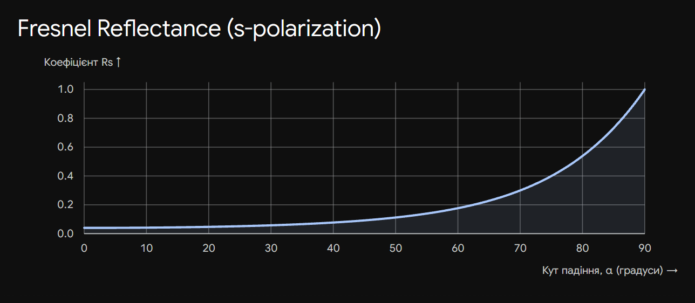

# 14. Формули Френеля для s-поляризованого світла

**Ключова ідея білета:** Формули Френеля визначають амплітуди відбитої та заломленої хвиль залежно від кута падіння та показників заломлення середовищ. Для **s-поляризованого світла** (від нім. _senkrecht_ — перпендикулярний) вектор напруженості електричного поля $\vec{E}$ коливається строго **перпендикулярно до площини падіння** (і паралельно до самої межі поділу).

## 1. Базові рівняння (Граничні умови)

Оскільки для s-поляризації вектори електричного поля падаючої ($i$), відбитої ($r$) та заломленої ($t$) хвиль лежать у площині межі поділу, умова безперервності тангенціальних компонент (з білета №13) записується алгебраїчно просто:

$$E_i + E_r = E_t$$

_(Тут і далі $E$ означає амплітуду відповідної хвилі)._

---

## 2. Амплітудні коефіцієнти Френеля

Використовуючи граничні умови для магнітного поля та закон заломлення Снеліуса, Френель вивів відношення амплітуд.

Вводяться амплітудні коефіцієнти відбивання ($r_s$) та пропускання ($t_s$):

**Через показники заломлення ($n_1, n_2$):**

$$r_s = \frac{E_r}{E_i} = \frac{n_1 \cos \alpha - n_2 \cos \beta}{n_1 \cos \alpha + n_2 \cos \beta}$$

$$t_s = \frac{E_t}{E_i} = \frac{2 n_1 \cos \alpha}{n_1 \cos \alpha + n_2 \cos \beta}$$

_(де $\alpha$ — кут падіння, $\beta$ — кут заломлення)._

**Через тригонометричні функції (найзручніша форма для іспиту):**
Застосувавши співвідношення $n_1 \sin \alpha = n_2 \sin \beta$, формули зводяться до:

$$r_s = - \frac{\sin(\alpha - \beta)}{\sin(\alpha + \beta)}$$

$$t_s = \frac{2 \sin \beta \cos \alpha}{\sin(\alpha + \beta)}$$

---

## 3. Енергетичні коефіцієнти

Приймачі світла (око, матриця телескопа) фіксують не амплітуду, а інтенсивність (енергію), яка пропорційна квадрату амплітуди.

- **Енергетичний коефіцієнт відбиття ($R_s$):** Показує частку відбитої енергії.

$$R_s = |r_s|^2 = \frac{\sin^2(\alpha - \beta)}{\sin^2(\alpha + \beta)}$$

- **Енергетичний коефіцієнт пропускання ($T_s$):**

$$T_s = 1 - R_s$$

_(з урахуванням закону збереження енергії)_.

---

## 4. Фізичні наслідки (Критично важливо для розуміння)

Екзаменатор обов'язково запитає про те, як поводиться ця хвиля на практиці. З формули для $r_s$ випливають три фундаментальні властивості s-поляризації:

1. **Втрата півхвилі (стрибок фази на $\pi$):** Якщо світло падає з оптично менш густого середовища в більш густе (наприклад, з повітря у скло, $n_1 < n_2$, тоді $\alpha > \beta$), то $\sin(\alpha - \beta) > 0$. Відповідно, за тригонометричною формулою **$r_s < 0$**. Цей знак мінус означає, що при відбитті фаза хвилі миттєво змінюється на $\pi$ (що еквівалентно зсуву на $\lambda/2$). Якщо ж відбиття відбувається від менш густого середовища, стрибка фази немає ($r_s > 0$).
2. **Відсутність кута Брюстера:**
   Дріб $\frac{\sin(\alpha - \beta)}{\sin(\alpha + \beta)}$ ніколи не дорівнює нулю (за винятком тривіального випадку $\alpha = \beta$, коли середовища однакові). Тобто, на відміну від p-поляризації, **s-хвиля відбивається при будь-яких кутах падіння**, вона ніколи не проходить у друге середовище на 100%.
3. **Монотонне зростання відбиття:**
   При збільшенні кута падіння $\alpha$ (від $0^\circ$ до $90^\circ$) енергетичний коефіцієнт $R_s$ монотонно зростає від мінімального значення (при нормальному падінні) до $1$ (повне відбиття при ковзному падінні).

**Висновок:**
Формули Френеля для s-поляризації дозволяють визначити амплітуду і фазу хвилі, електричний вектор якої паралельний поверхні відбиття. Головною особливістю цієї хвилі є те, що вона завжди частково відбивається і завжди зазнає втрати півхвилі при відбитті від оптично більш густого середовища.

---

