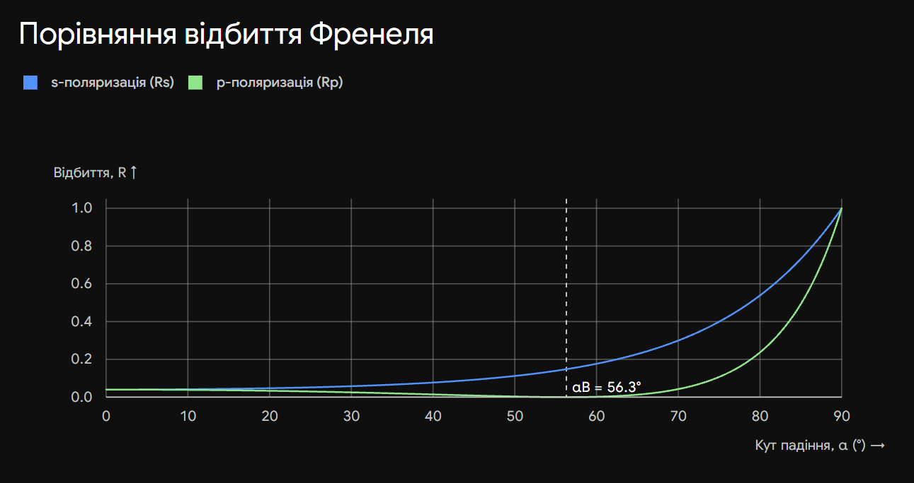

# 15. Формули Френеля для р-поляризованого світла

**Ключова ідея білета:** Для **р-поляризованого світла** (від нім. _parallel_ — паралельний) вектор напруженості електричного поля $\vec{E}$ коливається **в площині падіння**. Поведінка такої хвилі при відбитті кардинально відрізняється від s-поляризації, оскільки за певного кута падіння відбита хвиля може повністю зникнути.

## 1. Амплітудні коефіцієнти Френеля

Оскільки вектор $\vec{E}$ лежить у площині падіння, його проекція на межу поділу середовищ залежить від косинуса кута. Застосувавши граничні умови, отримуємо амплітудні коефіцієнти відбивання ($r_p$) та пропускання ($t_p$):

**Через показники заломлення ($n_1, n_2$):**

$$r_p = \frac{E_r}{E_i} = \frac{n_2 \cos \alpha - n_1 \cos \beta}{n_2 \cos \alpha + n_1 \cos \beta}$$

$$t_p = \frac{E_t}{E_i} = \frac{2 n_1 \cos \alpha}{n_2 \cos \alpha + n_1 \cos \beta}$$

**Через тригонометричні функції (найзручніша форма для іспиту):**

$$r_p = \frac{\tan(\alpha - \beta)}{\tan(\alpha + \beta)}$$

$$t_p = \frac{2 \sin \beta \cos \alpha}{\sin(\alpha + \beta) \cos(\alpha - \beta)}$$

---

## 2. Енергетичні коефіцієнти

Як і в попередньому білеті, енергетичний коефіцієнт визначає частку енергії (інтенсивності), що відбивається або проходить через межу.

- **Енергетичний коефіцієнт відбиття ($R_p$):**

$$R_p = |r_p|^2 = \frac{\tan^2(\alpha - \beta)}{\tan^2(\alpha + \beta)}$$

- **Енергетичний коефіцієнт пропускання ($T_p$):**

$$T_p = 1 - R_p$$

---

## 3. Фізичні наслідки (Критично важливо для іспиту)

Саме тут ховається головна відмінність від s-поляризації, яку екзаменатор обов'язково перевірить.

**1. Кут Брюстера (Повне пропускання):**
Зверніть увагу на знаменник у формулі для $R_p$. Якщо сума кутів падіння і заломлення дорівнює $90^\circ$ ($\alpha + \beta = 90^\circ$), то $\tan(90^\circ) = \infty$.
Якщо знаменник прямує до нескінченності, то:

$$r_p = 0 \quad \text{та} \quad R_p = 0$$

Це означає, що **відбитої хвилі немає взагалі** — світло повністю проходить у друге середовище. Цей особливий кут падіння називається кутом Брюстера ($\alpha_B$). З огляду на те, що $\beta = 90^\circ - \alpha_B$, закон Снеліуса перетворюється на **закон Брюстера**:

$$\tan \alpha_B = \frac{n_2}{n_1} = n_{21}$$

> _Наслідок для природного світла:_ Якщо на межу поділу падає звичайне (неполяризоване) світло під кутом Брюстера, то у відбитому промені р-компонента буде відсутня. Відбите світло стане **на 100% лінійно поляризованим** (міститиме лише s-компоненту).

**2. Стрибок фази:**
На відміну від s-хвилі, яка завжди змінює фазу на $\pi$ при відбитті від густішого середовища, для р-хвилі фаза залежить від кута:

- Якщо кут падіння **менший** за кут Брюстера ($\alpha < \alpha_B$), то $r_p > 0$ — стрибка фази **немає**.
- Якщо кут падіння **більший** за кут Брюстера ($\alpha > \alpha_B$), то $r_p < 0$ — відбувається **стрибок фази на $\pi$**.

**Висновок:**
Головною особливістю р-поляризованої хвилі є наявність кута повної прозорості (кута Брюстера), при падінні під яким хвиля не відбивається від межі поділу. Ця властивість масово використовується в оптиці для створення поляризаторів (стопи Столєтова) та просвітлення лазерних систем, де вікна кювет встановлюють саме під кутом Брюстера для уникнення втрат на відбиття.

---

Щоб наочно побачити різницю між двома поляризаціями та запам'ятати провал графіка до нуля (кут Брюстера), ось інтерактивний графік.

https://youtu.be/dvUZcd61bcE?si=YeKkpJsZEAyNQnNk
