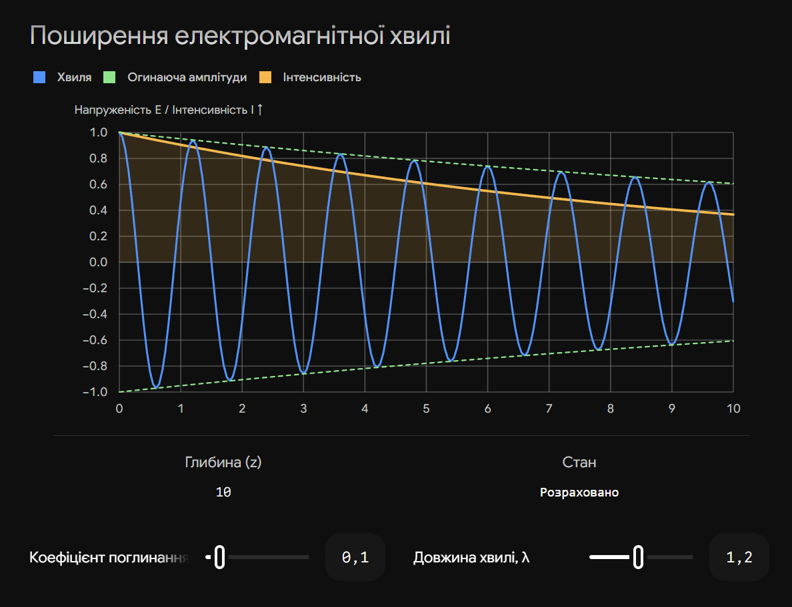
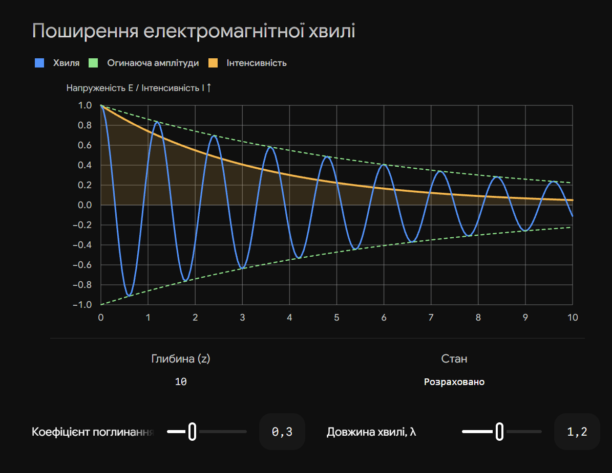

# 19. Поширення електромагнітних хвиль в поглинаючих середовищах. Показники поглинання та заломлення. Закон Бугера

**Ключова ідея білета:** У реальних середовищах (на відміну від ідеальних діелектриків) частина енергії електромагнітної хвилі витрачається на збудження атомів або нагрівання речовини (поглинається). Макроскопічно це описується законом Бугера, а мікроскопічно (через рівняння Максвелла) — введенням комплексного показника заломлення, де уявна частина відповідає за згасання амплітуди хвилі.

## 1. Закон Бугера (Макроскопічний опис)

Закон Бугера (або Бугера-Ламберта) описує експоненційне зменшення інтенсивності світла при проходженні через поглинаюче середовище.

**Формула закону Бугера:**

$$I = I_0 e^{-\alpha x}$$

| Величина                    | Позначення | Фізичний зміст                                                                                                                                                                          |
| --------------------------- | ---------- | --------------------------------------------------------------------------------------------------------------------------------------------------------------------------------------- |
| **Початкова інтенсивність** | $I_0$      | Інтенсивність світла на вході в середовище ($x=0$).                                                                                                                                     |
| **Кінцева інтенсивність**   | $I$        | Інтенсивність світла, що пройшло шар речовини товщиною $x$.                                                                                                                             |
| **Товщина шару**            | $x$        | Пройдена світлом відстань у метрах.                                                                                                                                                     |
| **Коефіцієнт поглинання**   | $\alpha$   | Характеризує властивості речовини (вимірюється в $\text{м}^{-1}$). Показує, на якій відстані інтенсивність падає в $e$ разів. Залежить від довжини хвилі $\lambda$ та природи речовини. |

> **Астрофізичний акцент:** В астрофізиці замість добутку $\alpha x$ часто використовують безрозмірну величину — **оптичну товщу ($\tau$)**. Закон Бугера записується як $I = I_0 e^{-\tau}$. Якщо $\tau \ll 1$, середовище оптично тонке (прозоре), якщо $\tau \gg 1$ — оптично товсте (непрозоре).

---

## 2. Комплексний показник заломлення (Хвильова теорія)

Якщо застосувати рівняння Максвелла до провідного або поглинаючого середовища, виявиться, що діелектрична проникність стає комплексною величиною. Оскільки показник заломлення $n = \sqrt{\varepsilon}$, він також стає комплексним.

**Комплексний показник заломлення ($\tilde{n}$):**

$$\tilde{n} = n - i\chi$$

_(де $i$ — уявна одиниця)._

- **Дійсна частина ($n$):** Це звичайний (головний) показник заломлення, який визначає фазову швидкість світла в середовищі ($v = c/n$).
- **Уявна частина ($\chi$):** Це **головний показник поглинання** (безрозмірна величина). Він визначає швидкість згасання амплітуди електромагнітної хвилі.

**Рівняння хвилі в поглинаючому середовищі:**
Якщо підставити $\tilde{n}$ у стандартне рівняння плоскої хвилі $\vec{E} = \vec{E}_0 e^{i(\omega t - \frac{\omega}{c}\tilde{n}z)}$, отримаємо:

$$\vec{E} = \vec{E}_0 e^{-\frac{\omega}{c}\chi z} \cdot e^{i\left(\omega t - \frac{\omega}{c}nz\right)}$$

Рівняння розпадається на два множники:

1. $e^{i(\dots)}$ — описує звичайні гармонічні коливання (поширення хвилі).
2. $e^{-\frac{\omega}{c}\chi z}$ — описує **експоненційне згасання амплітуди** в просторі вздовж осі $z$.

---

## 3. Зв'язок між хвильовою теорією та законом Бугера

Екзаменатор обов'язково запитає, як макроскопічний коефіцієнт $\alpha$ пов'язаний з мікроскопічним $\chi$.

1. Інтенсивність світла ($I$) пропорційна квадрату амплітуди напруженості електричного поля ($I \sim E^2$).
2. Підносимо до квадрата амплітудну частину хвилі:

$$(e^{-\frac{\omega}{c}\chi z})^2 = e^{-2\frac{\omega}{c}\chi z}$$

3. Отримуємо інтенсивність: $I = I_0 e^{-\frac{2\omega\chi}{c} z}$.
4. Порівнюємо це із законом Бугера $I = I_0 e^{-\alpha z}$ і знаходимо фундаментальний зв'язок:

$$\alpha = \frac{2\omega}{c}\chi = \frac{4\pi}{\lambda_0}\chi$$

_(де $\lambda_0 = 2\pi c / \omega$ — довжина хвилі світла у вакуумі)._

## Висновок

Поглинання світла є наслідком взаємодії електромагнітного поля з речовиною. У хвильовій оптиці воно строго враховується введенням комплексного показника заломлення, де уявна частина відповідає за втрати енергії. На макрорівні це призводить до експоненційного падіння інтенсивності світла з товщиною середовища за законом Бугера, що є критично важливим для розуміння процесів перенесення випромінювання в зоряних атмосферах та міжзоряному газі.

---

Ось інтерактивна візуалізація, яка показує просторове згасання хвилі. Ви можете змінювати показник поглинання і спостерігати, як швидко спадає амплітуда хвилі (і як стискається експоненційна "оболонка" за законом Бугера).

