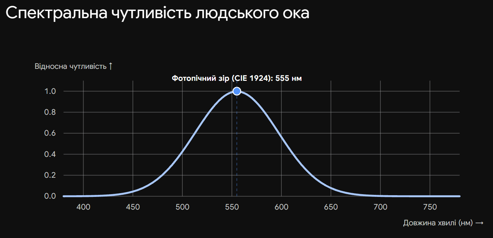

# 2. Крива видності ока. Зв'язок між енергетичними та світловими одиницями

**Ключова ідея білета:** Електричні прилади (болометри, фотоелементи) фіксують об'єктивну енергію випромінювання у Ватах. Людське око — це суб'єктивний приймач, який реагує на різні довжини хвиль неоднаково. Зв'язок між ними встановлюється через криву чутливості ока.

## 1. Крива видності ока (Функція спектральної світлової ефективності)

Людське око сприймає електромагнітне випромінювання лише у видимому діапазоні (приблизно від $380$ нм до $780$ нм).

**Крива видності $V(\lambda)$** — це графік, що показує відносну спектральну чутливість людського ока до випромінювання різної довжини хвилі при однаковій енергетичній потужності.

- **Максимум чутливості (денний зір):** Припадає на жовто-зелену частину спектра з довжиною хвилі $\lambda_m = 555$ нм. Для цієї довжини хвилі $V(555) = 1$.
- **Спад чутливості:** До країв видимого діапазону (червоного і фіолетового) чутливість ока стрімко падає, і $V(\lambda)$ наближається до нуля.
- _Додатковий факт (Ефект Пуркіньє):_ При слабкому освітленні (нічний зір) максимум чутливості зміщується в синьо-зелену область спектра ($\lambda \approx 507$ нм).

## 2. Відповідність енергетичних та світлових величин

Кожній об'єктивній (енергетичній/радіометричній) величині відповідає її суб'єктивний (світловий/фотометричний) аналог.

| Енергетична величина                 | Одиниця СІ     | Світлова величина              | Одиниця СІ       |
| ------------------------------------ | -------------- | ------------------------------ | ---------------- |
| **Енергетичний потік** ($\Phi_e$)    | Ват (**Вт**)   | **Світловий потік** ($\Phi_v$) | люмен (**лм**)   |
| **Енергетична сила світла** ($I_e$)  | **Вт/ср**      | **Сила світла** ($I_v$)        | кандела (**кд**) |
| **Енергетична освітленість** ($E_e$) | **Вт/м²**      | **Освітленість** ($E_v$)       | люкс (**лк**)    |
| **Енергетична яскравість** ($L_e$)   | **Вт/(ср·м²)** | **Яскравість** ($L_v$)         | **кд/м²**        |
| **Енергетична світність** ($M_e$)    | **Вт/м²**      | **Світність** ($M_v$)          | **лм/м²**        |

## 3. Математичний зв'язок між одиницями

Перехід від енергетичних (фізичних) величин до світлових здійснюється за допомогою кривої видності $V(\lambda)$ та фундаментальної константи.

**Максимальна світлова ефективність ($K_m$):**
Це коефіцієнт перерахунку для найбільш видимої довжини хвилі ($555$ нм).

$$K_m = 683 \text{ лм/Вт}$$

_(Фізичний зміст: джерело з довжиною хвилі 555 нм, що випромінює потужність 1 Вт, створює світловий потік рівно 683 люмени)._

**1. Для монохроматичного випромінювання (одна довжина хвилі $\lambda$):**
Світловий потік $\Phi_v$ пов'язаний з енергетичним $\Phi_e$ співвідношенням:

$$\Phi_v = K_m \cdot \Phi_e \cdot V(\lambda)$$

**2. Для складного спектра (реальні джерела світла):**
Якщо джерело випромінює неперервний спектр з лінійною густиною енергетичного потоку $\Phi_{e,\lambda} = \frac{d\Phi_e}{d\lambda}$, то загальний світловий потік знаходиться інтегруванням по всьому видимому діапазону:

$$\Phi_v = K_m \int_{380}^{780} \Phi_{e,\lambda} V(\lambda) d\lambda$$

_(Аналогічні інтегральні співвідношення діють для переходу між $I_e \rightarrow I_v$, $E_e \rightarrow E_v$ тощо)._

## Висновок

Світлові одиниці — це ті ж самі енергетичні одиниці, але "відкалібровані" під біологічний приймач — людське око. Для точного перерахунку Ватів у Люмени необхідно знати спектральний склад випромінювання джерела та помножити його на стандартизовану криву видності $V(\lambda)$, використовуючи константу $683$ лм/Вт.

---

Крива видності світла, або функція відносної спектральної світлової ефективності, показує, наскільки чутливе людське око до різних довжин хвиль світла. Вона показує, що ми найбільш чутливі до зеленого світла і менш чутливі до фіолетового та червоного. Існує дві основні криві: для денного (фотопічного) та нічного (скотопічного) зору.

Ви можете скористатися інтерактивним інструментом нижче, щоб дослідити та порівняти обидві ці криві.
