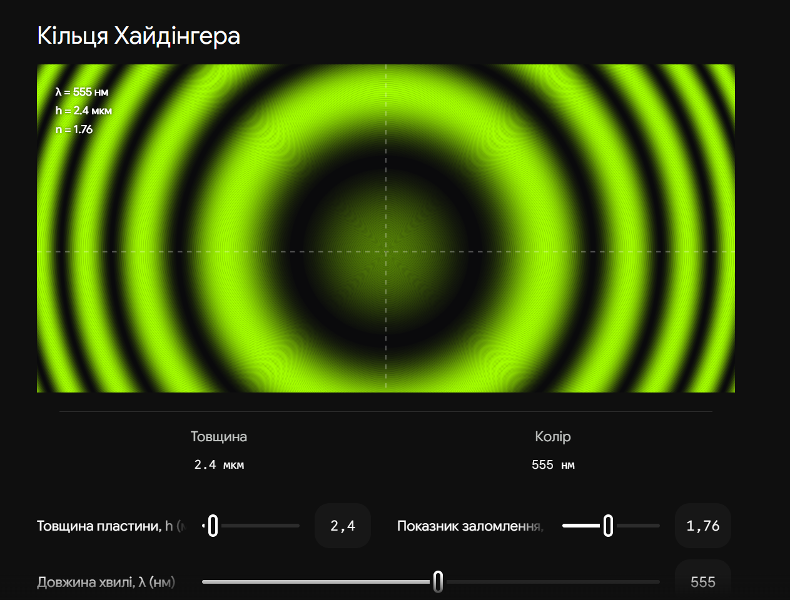
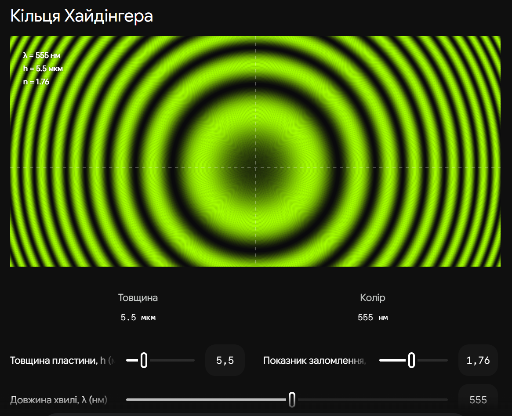
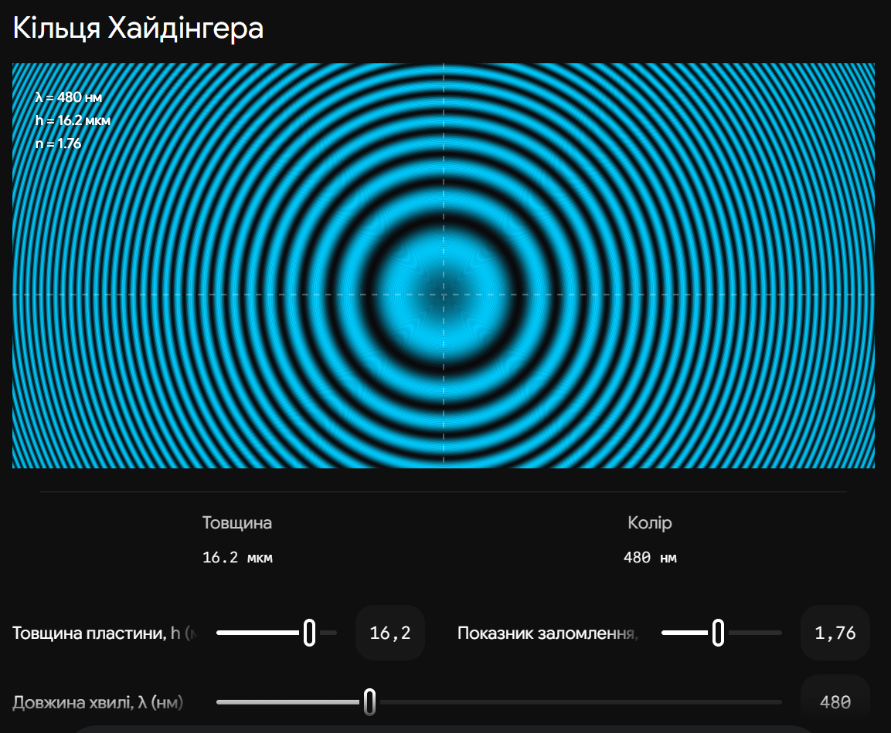

# 22. Інтерференція світла в плоскопаралельній пластині. Смуги рівного нахилу

**Ключова ідея білета:** В основі цього явища лежить метод **поділу амплітуди**. Коли світло падає на товсту скляну пластину, воно частково відбивається від верхньої грані, а частково проходить всередину і відбивається від нижньої грані. Ці два відбиті промені виходять з пластини паралельно один одному і можуть інтерферувати.

## 1. Оптична різниця ходу ($\Delta$)

Розглянемо плоскопаралельну пластину товщиною $h$ з показником заломлення $n$, що знаходиться в повітрі ($n_0 \approx 1$). На неї падає плоска монохроматична хвиля (довжина хвилі $\lambda$) під кутом $\alpha$. Кут заломлення в пластині — $\beta$.

Оптична різниця ходу між променем, відбитим від верхньої грані, та променем, відбитим від нижньої грані, складається з двох частин:

1. Різниця геометричних шляхів, помножена на показники заломлення середовищ.
2. **Додатковий зсув (втрата півхвилі):** Як ми знаємо з формул Френеля (білет 14), при відбитті світла від оптично більш густого середовища (від верхньої грані пластини) фаза хвилі стрибком змінюється на $\pi$, що еквівалентно збільшенню шляху на $\lambda/2$. При відбитті від нижньої грані (зсередини скла у повітря) такого стрибка немає.

Точна формула оптичної різниці ходу:

$$\Delta = 2hn \cos \beta + \frac{\lambda}{2}$$

Застосувавши закон заломлення ($\sin \alpha = n \sin \beta$), цю формулу часто записують через кут падіння $\alpha$, що зручніше для практики:

$$\Delta = 2h \sqrt{n^2 - \sin^2 \alpha} + \frac{\lambda}{2}$$

---

## 2. Умови максимумів та мінімумів

Як і в будь-якій інтерференційній схемі, результат накладання хвиль залежить від того, скільки довжин хвиль вкладається у різницю ходу.

| Результат             | Умова               | Формула для плоскопаралельної пластини                           |
| --------------------- | ------------------- | ---------------------------------------------------------------- |
| **Максимум (світло)** | $\Delta = m\lambda$ | $$2h \sqrt{n^2 - \sin^2 \alpha} + \frac{\lambda}{2} = m\lambda$$ |

|
| **Мінімум (темрява)** | $\Delta = (m + \frac{1}{2})\lambda$ | $$2h \sqrt{n^2 - \sin^2 \alpha} + \frac{\lambda}{2} = \left(m + \frac{1}{2}\right)\lambda$$

|
| _(де $m = 0, 1, 2...$ — порядок інтерференції)._ | | |

---

## 3. Смуги рівного нахилу (Смуги Гайдінгера)

З формули різниці ходу видно, що $\Delta$ залежить від трьох параметрів: товщини пластини ($h$), показника заломлення ($n$) та кута падіння ($\alpha$).

**Як утворюються смуги рівного нахилу:**

- **Умова:** Пластина ідеально плоскопаралельна ($h = \text{const}$) і однорідна ($n = \text{const}$).
- **Джерело:** Використовується _протяжне_ (широке) джерело світла, яке випромінює промені в усіх напрямках.
- **Механізм:** За таких умов різниця ходу $\Delta$ залежить **виключно від кута падіння $\alpha$**. Всі промені, що падають на пластину під _однаковим кутом_ (однаковим нахилом), матимуть однакову різницю ходу і сформують одну спільну інтерференційну смугу.

**Характеристики смуг рівного нахилу:**

1. **Геометрична форма:** Якщо дивитися на пластину перпендикулярно (нормально), смуги мають вигляд **концентричних кілець**. Центр кілець відповідає променям, що падають перпендикулярно ($\alpha = 0$).
2. **Локалізація:** Оскільки промені, що утворюють одну смугу, виходять з пластини паралельними пучками, вони перетнуться лише на нескінченності. Тому кажуть, що смуги рівного нахилу **локалізовані в нескінченності**.
3. **Спостереження:** Щоб побачити ці смуги в лабораторії, використовують збиральну лінзу (або кришталик ока, сфокусований на нескінченність). Смуги формуються у **фокальній площині** цієї лінзи.

## Висновок

Інтерференція в плоскопаралельній пластині відбувається за рахунок поділу амплітуди. Якщо пластина має строго сталу товщину, інтерференційна картина формується пучками променів, що падають під однаковим кутом. Такі смуги називаються смугами рівного нахилу, вони мають форму кілець і локалізовані на нескінченності (або у фокусі об'єктива). Вони є базовим принципом роботи інтерферометра Фабрі-Перо, який використовується в астрофізиці для спектроскопії високої роздільної здатності.

---

Ось інтерактивна візуалізація, яка дозволяє побачити, як виглядають смуги рівного нахилу у фокальній площині лінзи, і як вони реагують на зміну товщини пластини чи довжини хвилі світла. Зверніть увагу: при збільшенні товщини пластини $h$ кільця стають густішими (зростає порядок інтерференції).

