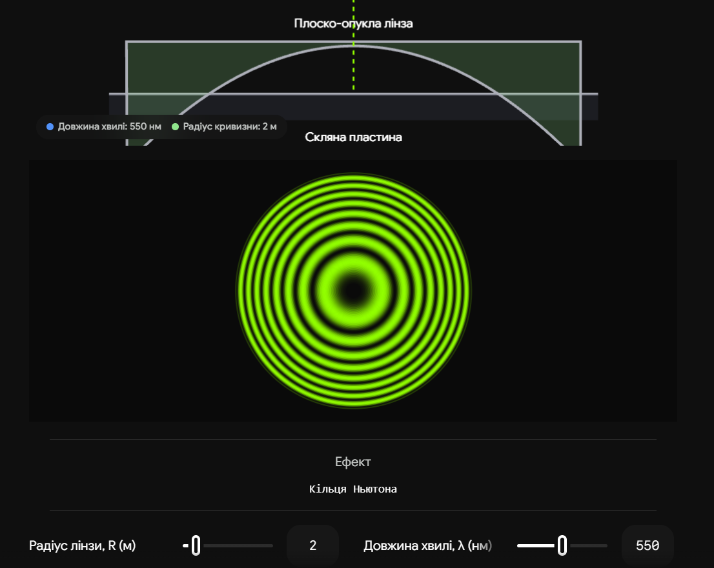
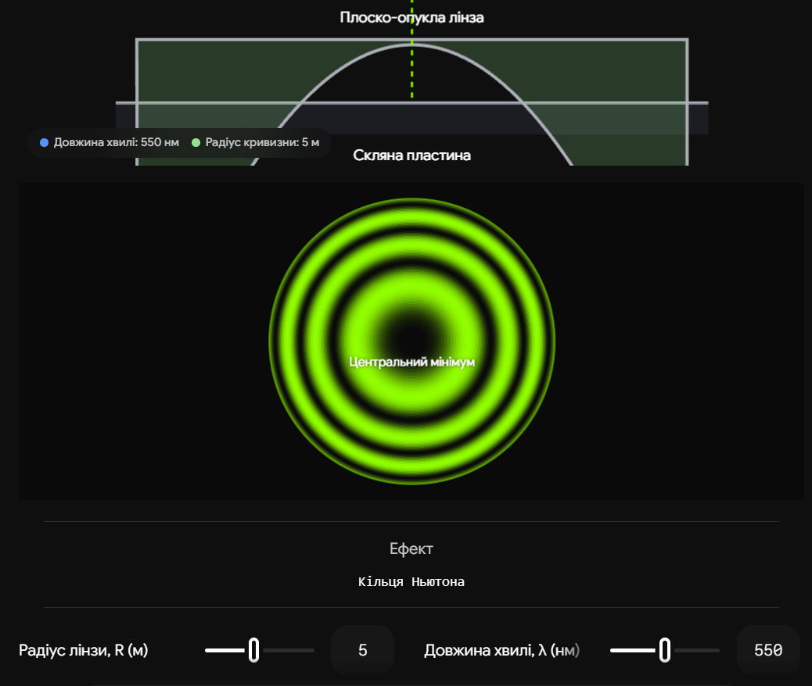

# 23. Смуги рівної товщини. Клин, кільця Ньютона

**Ключова ідея білета:** Якщо на прозору плівку **змінної товщини** падає паралельний пучок світла, то оптична різниця ходу відбитих променів залежить переважно від товщини плівки в даній точці. Геометричне місце точок з однаковою товщиною утворює єдину інтерференційну смугу (смугу рівної товщини). Вони схожі на лінії висот (ізогіпси) на топографічній карті.

## 1. Загальний принцип та локалізація

Оптична різниця ходу для плівки з показником заломлення $n$ і товщиною $h$ визначається формулою (з урахуванням втрати півхвилі при відбитті від густішого середовища):

$$\Delta = 2hn \cos \beta + \frac{\lambda}{2}$$

Для спостереження смуг рівної товщини світло зазвичай спрямовують перпендикулярно до поверхні (нормальне падіння, $\alpha = 0, \beta = 0, \cos \beta = 1$). Тоді різниця ходу залежить **лише від товщини $h$**:

$$\Delta = 2hn + \frac{\lambda}{2}$$

**Локалізація:** На відміну від смуг рівного нахилу (які виникають у паралельній пластині і локалізовані на нескінченності), смуги рівної товщини **локалізовані на самій поверхні плівки**. Око або об'єктив мікроскопа потрібно фокусувати безпосередньо на плівку, щоб їх побачити.

---

## 2. Інтерференція у клині

**Клин** — це тонка плівка (часто повітряний зазор між двома скляними пластинками), товщина якої лінійно зростає. Кут при вершині клина $\alpha$ дуже малий.

- **Форма смуг:** Оскільки лінії однакової товщини у клині — це прямі лінії, паралельні ребру клина, інтерференційна картина має вигляд системи **паралельних світлих і темних смуг**.
- **Ширина смуги ($\Delta x$):** Це відстань між центрами двох сусідніх світлих (або темних) смуг. Товщина клина при переході до сусідньої смуги змінюється рівно на $\lambda / 2$. З геометричних міркувань ($h = x \cdot \tan \alpha \approx x \cdot \alpha$), ширина смуги дорівнює:

$$\Delta x = \frac{\lambda}{2 \alpha n}$$

_(де $\alpha$ — кут клина у радіанах). З формули видно: чим гостріший клин, тим ширші смуги._

---

## 3. Кільця Ньютона

Це класичний приклад смуг рівної товщини, що утворюються у повітряному зазорі між плоскою скляною пластиною та плоско-опуклою лінзою з дуже великим радіусом кривизни $R$.

- **Форма смуг:** Оскільки повітряний зазор має радіальну симетрію (товщина однакова на однаковій відстані від центру), смуги мають вигляд **концентричних кілець**.
- **Центральна пляма:** У точці дотику лінзи і пластини товщина зазору $h \approx 0$. Через втрату півхвилі ($\lambda/2$) при відбитті від нижньої пластини, хвилі зустрічаються в протифазі. Тому **в центрі кілець Ньютона у відбитому світлі завжди спостерігається темна пляма**.

**Формули радіусів кілець (на іспиті вимагають саме їх):**
Геометричний зв'язок товщини зазору $h$ з радіусом кільця $r$ та радіусом лінзи $R$: $h \approx \frac{r^2}{2R}$.
Підставивши це в умови максимуму і мінімуму для відбитого світла (зазор повітряний, $n=1$), отримаємо радіуси $m$-го кільця:

1. **Радіус темного кільця:**

$$r_m = \sqrt{m \lambda R}$$

_(де $m = 0, 1, 2...$ Для центральної темної плями $m=0$)._ 2. **Радіус світлого кільця:**

$$r_m = \sqrt{\left(m - \frac{1}{2}\right) \lambda R}$$

_(де $m = 1, 2, 3...$)._

## Висновок

Смуги рівної товщини є прямим оптичним відображенням мікрорельєфу поверхні. Клин створює систему рівновіддалених паралельних ліній, а лінза на площині — кільця Ньютона. Вимірювання радіусів цих кілець або ширини смуг клина є одним із найточніших оптичних методів вимірювання довжини хвилі світла $\lambda$ або контролю якості шліфування лінз та дзеркал (в тому числі для астрономічних телескопів).

---

Ось інтерактивна симуляція кілець Ньютона. Вона показує, як кривизна лінзи та колір світла (довжина хвилі) впливають на масштаб інтерференційної картини. Зверніть увагу: центральна пляма завжди залишається чорною.

