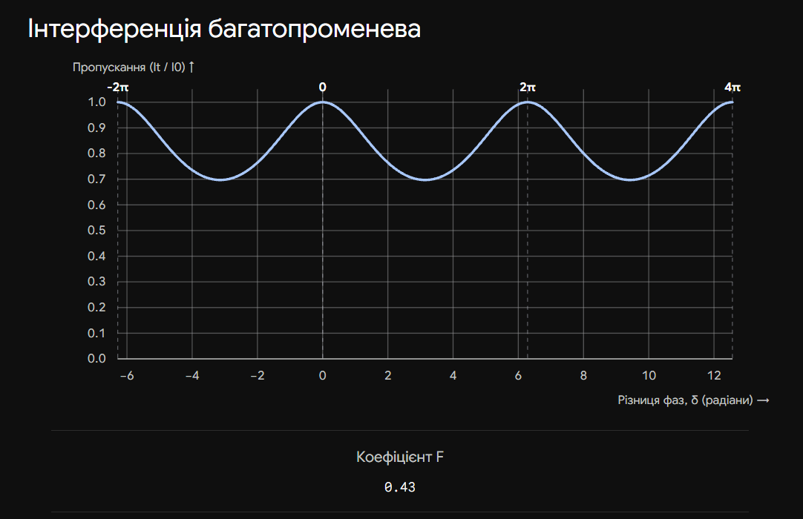
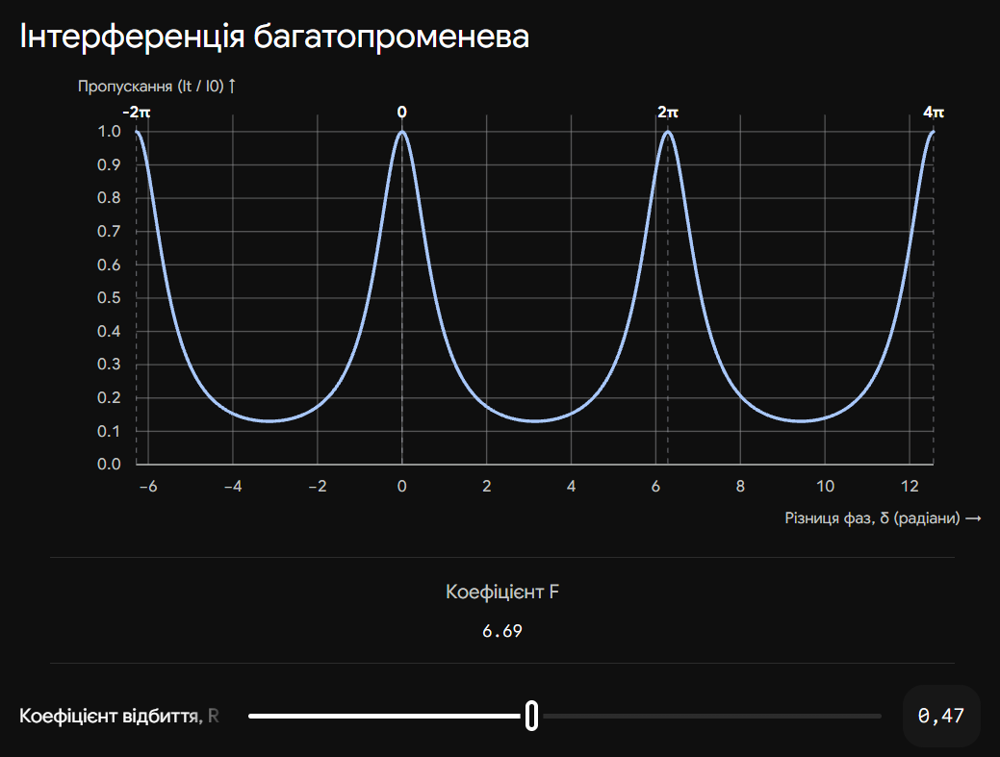

# 24. Багатопроменева інтерференція в плоскопаралельній пластині. Формула Ейрі

**Ключова ідея білета:** Якщо грані плоскопаралельної пластини мають високий коефіцієнт відбиття (наприклад, вкриті напівпрозорим шаром срібла), світло всередині неї відбивається туди-сюди багато разів. Замість двох променів інтерферує нескінченна кількість променів. Це кардинально змінює картину: світлі смуги (максимуми пропускання) стають **надзвичайно вузькими та різкими**, що дозволяє будувати надточні спектральні прилади (інтерферометри Фабрі-Перо).

## 1. Механізм утворення багатопроменевої інтерференції

Нехай на пластину товщиною $h$ падає світлова хвиля.

1. На першій межі частина світла проходить всередину, а частина відбивається.
2. Пройшовши пластину, світло досягає другої межі. Знову частина виходить назовні, а частина відбивається назад у пластину.
3. Цей процес багаторазового відбиття триває нескінченно.

У результаті з пластини виходить безліч паралельних променів (як у відбитому, так і в пропущеному світлі).
Амплітуди цих променів поступово зменшуються (утворюють геометричну прогресію), а різниця фаз $\delta$ між будь-якими двома сусідніми променями залишається сталою:

$$\delta = \frac{2\pi}{\lambda} \Delta = \frac{4\pi}{\lambda} h n \cos \beta$$

_(де $\beta$ — кут заломлення в пластині)._

---

## 2. Формула Ейрі

Щоб знайти загальну інтенсивність світла, що пройшло крізь пластину ($I_t$), потрібно додати амплітуди всіх цих нескінченних хвиль з урахуванням їхніх фаз. Математично це зводиться до суми нескінченно спадної геометричної прогресії комплексних чисел.

Результат цього додавання називається **формулою Ейрі (функцією Ейрі)**:

$$I_t = \frac{I_0}{1 + F \sin^2\left(\frac{\delta}{2}\right)}$$

| Параметр                | Позначення | Фізичний зміст                                                                    |
| ----------------------- | ---------- | --------------------------------------------------------------------------------- |
| **Інтенсивність**       | $I_t, I_0$ | $I_t$ — інтенсивність пропущеного світла, $I_0$ — інтенсивність падаючого світла. |
| **Різниця фаз**         | $\delta$   | Залежить від товщини пластини, кута падіння та довжини хвилі.                     |
| **Коефіцієнт різкості** | $F$        | $F = \frac{4R}{(1-R)^2}$. Визначає "гостроту" інтерференційних смуг.              |
| **Коефіцієнт відбиття** | $R$        | Енергетичний коефіцієнт відбиття від однієї межі пластини (від 0 до 1).           |

---

## 3. Аналіз формули Ейрі (Фізичні наслідки)

Екзаменатор очікує, що ви зможете проаналізувати цю формулу для максимумів і мінімумів:

**1. Умова максимумів (Світлі смуги пропускання):**
Коли $\frac{\delta}{2} = m\pi$ (де $m$ — ціле число), синус дорівнює нулю ($\sin^2(\dots) = 0$).
Тоді знаменник у формулі Ейрі дорівнює 1, і:

$$I_t = I_0$$

_Висновок:_ У максимумах пластина стає абсолютно прозорою ($100\%$ пропускання), незалежно від того, наскільки сильно відбивають її поверхні (навіть якщо $R = 0.99$).

**2. Умова мінімумів (Темний фон):**
Коли $\frac{\delta}{2} = \left(m + \frac{1}{2}\right)\pi$, синус максимальний ($\sin^2(\dots) = 1$).
Тоді інтенсивність мінімальна:

$$I_{min} = \frac{I_0}{1 + F} = I_0 \left( \frac{1 - R}{1 + R} \right)^2$$

_Висновок:_ Чим ближчий коефіцієнт відбиття $R$ до одиниці, тим більше значення $F$ (воно прямує до нескінченності). Відповідно, інтенсивність між максимумами $I_{min}$ прямує до нуля.

**3. Звуження смуг (Найголовніше!):**
Якщо $R$ мале (наприклад, для звичайного скла $R \approx 0.04$), $F$ теж мале. Графік пропускання схожий на плавну синусоїду (як при двопроменевій інтерференції).
Але якщо грані посріблити ($R \to 1$), $F$ стає величезним (тисячі). Завдяки цьому будь-яке мінімальне відхилення фази $\delta$ від максимуму призводить до різкого падіння інтенсивності до нуля. Світлі смуги перетворюються на **тонкі, як голка, спектральні лінії** на абсолютно чорному тлі.

## Висновок

Багатопроменева інтерференція відрізняється від двопроменевої формою інтерференційних смуг. Завдяки багаторазовому накладанню хвиль, описаному формулою Ейрі, можна досягти колосального звуження інтерференційних максимумів шляхом збільшення коефіцієнта відбиття граней. Цей принцип лежить в основі еталона Фабрі-Перо та оптичних резонаторів лазерів.

---

Ця інтерактивна візуалізація демонструє магію багатопроменевої інтерференції. Потягніть повзунок коефіцієнта відбиття $R$ вправо і подивіться, як плавна синусоїда (що відповідає 2 променям) перетворюється на серію надзвичайно гострих піків.

