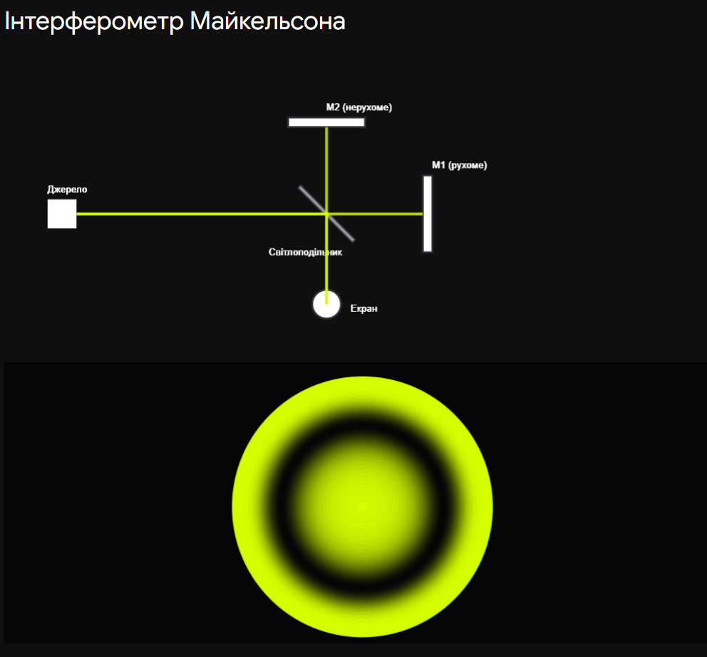

# 25. Інтерферометр Майкельсона

**Ключова ідея білета:** Інтерферометр Майкельсона — це класичний двопроменевий прилад, що працює за принципом **поділу амплітуди**. Світловий пучок ділиться напівпрозорим дзеркалом на два взаємно перпендикулярні промені, які проходять різні відстані, відбиваються, а потім знову з'єднуються, утворюючи інтерференційну картину. Він дозволяє з безпрецедентною точністю вимірювати довжини хвиль, показники заломлення та мікрозміщення.

## 1. Оптична схема та принцип дії

Класичний інтерферометр складається з таких елементів:

1. **Джерело світла** (зазвичай монохроматичне, розширене лінзою).
2. **Світлоділильна пластина ($P_1$):** Встановлена під кутом $45^\circ$ до променя. Напівпрозорий шар срібла на ній пропускає $50\%$ світла і відбиває $50\%$.
3. **Два непрозорі дзеркала ($M_1$ та $M_2$):** Одне дзеркало жорстко закріплене ($M_2$), а інше ($M_1$) може дуже плавно переміщуватись за допомогою мікрометричного гвинта.
4. **Компенсаційна пластина ($P_2$):** _Важлива деталь для іспиту!_ Промінь, що йде до дзеркала $M_2$, проходить через скло світлоділильної пластини тричі, а промінь до $M_1$ — лише один раз. Щоб вирівняти оптичні шляхи в склі (особливо для білого світла), на шляху першого променя ставлять таку ж скляну пластину, але без срібного покриття.

**Хід променів:**
Світло від джерела падає на $P_1$, ділиться на промінь 1 (йде до $M_1$) і промінь 2 (йде до $M_2$). Після відбиття від дзеркал вони повертаються на $P_1$, де знову частково відбиваються/пропускаються, накладаються один на одного і спрямовуються в об'єктив телескопа або на екран.

---

## 2. Оптична різниця ходу та форма смуг

Якщо дивитися з боку екрана, ми бачимо дзеркало $M_1$ і **уявне зображення дзеркала $M_2$** ($M_2'$), яке формується світлоділильною пластиною.
Інтерференція в приладі Майкельсона повністю еквівалентна інтерференції у повітряному шарі між дзеркалом $M_1$ та уявним дзеркалом $M_2'$.

Нехай відстань від $P_1$ до $M_1$ дорівнює $L_1$, а до $M_2$ дорівнює $L_2$.
Тоді товщина еквівалентного повітряного шару: $d = L_1 - L_2$.
Оскільки світло проходить цей шар туди і назад, **оптична різниця ходу ($\Delta$)**:

$$\Delta = 2d \cos \alpha = 2(L_1 - L_2) \cos \alpha$$

_(де $\alpha$ — кут падіння променів на дзеркала)._

**Форма інтерференційної картини залежить від юстирування дзеркал:**

| Положення дзеркал                   | Еквівалент                             | Форма смуг                                     | Умова спостереження              |
| ----------------------------------- | -------------------------------------- | ---------------------------------------------- | -------------------------------- |
| $M_1$ строго паралельно $M_2'$      | Плоскопаралельна пластина товщиною $d$ | **Смуги рівного нахилу (концентричні кільця)** | Фокальна площина об'єктива       |
| $M_1$ під невеликим кутом до $M_2'$ | Повітряний клин                        | **Смуги рівної товщини (паралельні прямі)**    | Локалізовані на поверхні дзеркал |

---

## 3. Практичне застосування (Головна формула)

Головна перевага інтерферометра Майкельсона — рухоме дзеркало $M_1$.

Якщо перемістити дзеркало $M_1$ на відстань $\Delta x$, оптична різниця ходу зміниться на $2 \Delta x$.
Якщо ця зміна дорівнює одній довжині хвилі ($\lambda$), інтерференційна картина **зміститься рівно на одну смугу** (одне кільце виникне з центру або "сховається" в ньому).

Формула для вимірювань:

$$\Delta x = m \frac{\lambda}{2}$$

_(де $m$ — кількість смуг, що пройшли через перехрестя ниток в окулярі)._

**Що можна виміряти:**

1. **Точне вимірювання мікрозміщень ($\Delta x$):** Якщо відома $\lambda$, підрахувавши кількість смуг $m$, можна виміряти переміщення з точністю до нанометрів (так було створено перший еталон метра через довжину хвилі криптону).
2. **Вимірювання довжини хвилі ($\lambda$):** Якщо змістити мікрометр на відому відстань $\Delta x$ і порахувати смуги $m$.
3. **Вимірювання показника заломлення газів ($n$):** Якщо в одне з плечей поставити кювету довжиною $L$ і відкачувати з неї повітря, оптичний шлях зміниться на $\Delta = 2L(n - 1)$. За зсувом смуг можна розрахувати $n$.

## Висновок

Інтерферометр Майкельсона — ідеальний інструмент для демонстрації інтерференції при розділенні амплітуди. Завдяки рухомому дзеркалу він перетворює мікроскопічні зміни фази на макроскопічний рух інтерференційних смуг. Саме на цьому приладі було проведено знаменитий дослід Майкельсона-Морлі, який довів відсутність "ефіру", а сучасні гігантські версії цього інтерферометра (проєкт LIGO з плечима по 4 км) використовуються для реєстрації гравітаційних хвиль.

---

Ця інтерактивна симуляція показує класичну картину смуг рівного нахилу в інтерферометрі. Спробуйте плавно перемістити дзеркало $M_1$ за допомогою повзунка і поспостерігайте, як кільця "народжуються" в центрі або "зникають" у ньому.

