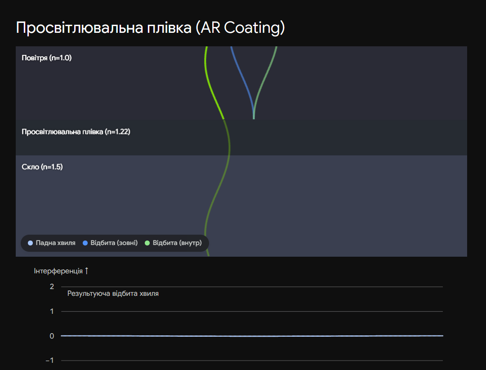

# 26. Просвітлення оптики. Інтерференційні світлофільтри

**Ключова ідея білета:** Обидва пристрої базуються на інтерференції в тонких плівках, але мають протилежні цілі. **Просвітлення оптики** використовує двопроменеву інтерференцію для _знищення_ відбитого світла і максимізації пропускання. **Інтерференційні світлофільтри** використовують багатопроменеву інтерференцію для _відбиття_ майже всього спектра і пропускання лише однієї надзвичайно вузької лінії (конкретного кольору).

---

## 1. Просвітлення оптики

**Проблема:** При переході світла через межу "повітря-скло" втрачається близько $4-5\%$ енергії на відбиття (за формулами Френеля). У складному об'єктиві (наприклад, астрографа), який має 10-15 лінз, ці втрати можуть сягати $50\%$. Крім того, відбиті промені створюють "відблиски" та знижують контраст зображення.

**Рішення (Просвітлювальна плівка):** На поверхню лінзи наносять тонку прозору плівку з показником заломлення $n_{пл}$, який менший за показник заломлення скла $n_{скла}$, але більший за повітря ($n_0 \approx 1$). Тобто: $n_0 < n_{пл} < n_{скла}$.

Світло відбивається двічі: від верхньої межі плівки та від її нижньої межі (від скла). Ці дві відбиті хвилі інтерферують. Щоб вони повністю **погасили одна одну**, мають виконуватися дві умови:

| Умова                          | Формула                                  | Фізичний зміст |
| ------------------------------ | ---------------------------------------- | -------------- |
| **1. Фазова (Умова мінімуму)** | $$h \cdot n_{пл} = \frac{\lambda_0}{4}$$ |

| Оптична товщина плівки має дорівнювати чверті довжини хвилі ($1/4 \lambda_0$). _Увага для іспиту:_ Оскільки відбиття на обох межах відбувається від оптично густішого середовища, стрибок фази на $\pi$ відбувається двічі. Вони компенсують один одного. Різниця ходу $\Delta = 2hn_{пл}$. Щоб хвилі зустрілися в протифазі, треба $\Delta = \lambda_0/2$. Звідси $2hn_{пл} = \lambda_0/2 \implies hn_{пл} = \lambda_0/4$. |
| **2. Амплітудна (Повне гасіння)** | $$n_{пл} = \sqrt{n_{скла} \cdot n_0} \approx \sqrt{n_{скла}}$$

| Щоб відбиті хвилі повністю погасили одна одну ($I_{min} = 0$), їхні амплітуди мають бути строго однаковими. Це досягається, коли показник заломлення плівки є середнім геометричним між показниками середовищ. |

> **Наслідок:** Плівку розраховують для найчутливішої до ока довжини хвилі (зелений колір, $\lambda_0 \approx 555$ нм). Для червоного і синього кольорів умова виконується не ідеально, тому вони частково відбиваються. Саме тому просвітлені об'єктиви відсвічують пурпуровим (бузковим) кольором.

---

## 2. Інтерференційні світлофільтри

**Призначення:** Виділення з суцільного білого спектра дуже вузької монохроматичної лінії (шириною всього $1-5$ нм). Це критично для лазерної техніки та астрофізики (наприклад, для спостереження сонячних протуберанців у лінії водню $H_\alpha$).

**Будова та принцип дії:**
Інтерференційний фільтр — це мініатюрний твердотільний інтерферометр Фабрі-Перо. Він складається з трьох шарів:

1. Напівпрозоре дзеркало (високий коефіцієнт відбиття $R \to 1$).
2. Прошарок прозорого діелектрика товщиною $h$.
3. Друге напівпрозоре дзеркало.

Тут працює **багатопроменева інтерференція**. Світло потрапляє в прошарок діелектрика і багаторазово відбивається між двома дзеркалами (як у білеті 24).

**Умова пропускання:**
Фільтр стає абсолютно прозорим (пропускає $100\%$ світла) ТІЛЬКИ для тих довжин хвиль $\lambda$, для яких оптична різниця ходу між сусідніми променями дорівнює цілому числу довжин хвиль:

$$2 h n = m \lambda$$

_(де $m = 1, 2, 3...$)._

Для всіх інших довжин хвиль, які хоча б трохи не задовольняють цю умову, спрацьовує формула Ейрі: інтенсивність пропущеного світла різко падає майже до нуля, і ці хвилі відбиваються назад.

## Висновок

- **Просвітлення (плівка $\lambda/4$):** Використовує дві хвилі в протифазі. Знищує відбиття, робить скло невидимим. Широка смуга дії.
- **Світлофільтр (плівка $\lambda/2$ між дзеркалами):** Використовує нескінченну кількість хвиль у фазі. Відбиває майже все, крім однієї тонкої спектральної лінії.

---

Ось інтерактивна візуалізація просвітлення оптики. Вона показує, як саме "чвертьхвильова плівка" змушує дві відбиті хвилі зустрітися в ідеальній протифазі. Спробуйте змінити довжину хвилі (колір світла), і ви побачите, що плівка, налаштована на зелений, перестане ідеально гасити червоний колір.

