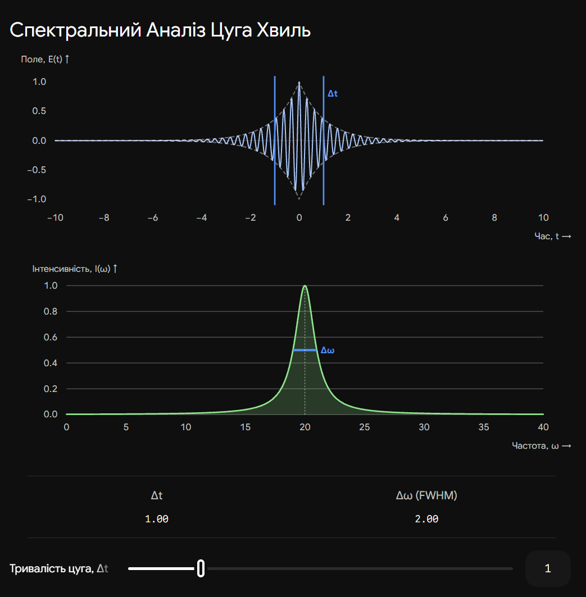
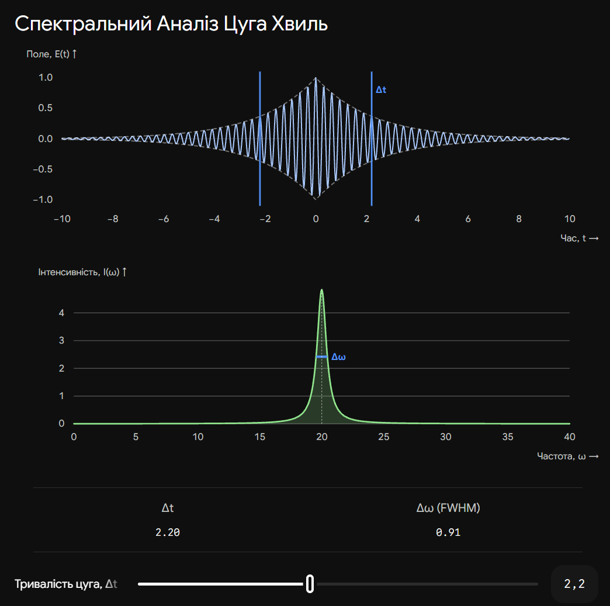

# 27. Світловий цуг та його спектр

**Ключова ідея білета:** Абсолютно монохроматичної хвилі (яка має лише одну точну частоту $\omega_0$) у природі не існує, оскільки така хвиля мала б тривати нескінченно довго у часі та просторі. Реальні джерела (атоми) випромінюють світло короткими "порціями" — **світловими цугами**. Через те, що цуг обмежений у часі, згідно з теоремою Фур'є, він складається з цілого набору (спектра) різних частот.

## 1. Світловий цуг (Випромінювання атома)

Процес випромінювання світла звичайними джерелами (сонце, лампа розжарювання, газ) має дискретний характер.
Коли електрон в атомі переходить зі збудженого стану в основний, він випромінює порцію електромагнітної енергії. Класична фізика розглядає цей процес як коливання згасаючого осцилятора.

- **Час висвічування ($\tau$):** Процес випромінювання одного цуга атомом триває дуже короткий час, зазвичай $\tau \approx 10^{-8}$ секунд.
- **Довжина цуга ($l$):** За цей час передній фронт хвилі встигає відлетіти на відстань $l = c \cdot \tau$. Для звичайного атома просторова довжина світлового цуга становить приблизно **3 метри**.
- **Форма цуга:** Математично його можна описати як косинусоїду, амплітуда якої експоненційно згасає з часом:

$$E(t) = E_0 e^{-\gamma t / 2} \cos(\omega_0 t)$$

_(де $\gamma$ — коефіцієнт згасання, $\omega_0$ — центральна частота)._

---

## 2. Спектр світлового цуга (Перетворення Фур'є)

Щоб знайти спектр (набір частот) будь-якого сигналу, використовують математичний апарат — інтеграл Фур'є. Згідно з ним, будь-який обмежений у часі сигнал можна подати як суму нескінченної кількості нескінченно довгих монохроматичних хвиль з різними частотами ($\omega$) та амплітудами.

Якщо застосувати перетворення Фур'є до експоненційно згасаючого цуга, виявиться, що його енергія не зосереджена на одній частоті $\omega_0$, а "розмазана" по певному інтервалу.
Розподіл інтенсивності від частоти (спектр) має вигляд **контуру Лоренца**:

$$I(\omega) \sim \frac{1}{(\omega - \omega_0)^2 + (\gamma/2)^2}$$

Цей графік являє собою пік із центром у точці $\omega_0$, який плавно спадає до країв.

---

## 3. Фундаментальне співвідношення (Ширина спектра)

Найважливіший висновок із Фур'є-аналізу для фізики полягає у зворотному зв'язку між тривалістю сигналу і шириною його спектра.

Ширина спектра ($\Delta \omega$, або напівширина контуру) обернено пропорційна тривалості світлового цуга ($\Delta t \approx \tau$):

$$\Delta \omega \cdot \Delta t \approx 2\pi$$

Або через лінійну частоту ($\nu = \omega / 2\pi$):

$$\Delta \nu \cdot \Delta t \approx 1$$

**Фізичний наслідок:**

- Чим довший цуг ($\Delta t \to \infty$), тим вужчий його спектр ($\Delta \nu \to 0$). У границі це ідеальна монохроматична хвиля.
- Чим коротший цуг (як у фемтосекундних лазерів, де $\Delta t \sim 10^{-15}$ с), тим ширшим є його спектр (світло стає "білим", охоплюючи величезний діапазон частот).

---

## 4. Природна ширина спектральної лінії

В астрофізиці та спектроскопії спектральні лінії ніколи не бувають нескінченно тонкими. Навіть якщо усунути теплове розширення (ефект Доплера) та зіткнення атомів (шляхом глибокого вакууму та охолодження), спектральна лінія все одно матиме певну мінімальну товщину.

Ця мінімальна товщина називається **природною шириною спектральної лінії** ($\Delta \lambda$). Вона зумовлена виключно скінченним часом життя атома у збудженому стані (обмеженістю світлового цуга).

Використовуючи зв'язок між довжиною хвилі та частотою ($\lambda = c / \nu$, звідки $|\Delta \lambda| = \frac{\lambda^2}{c} \Delta \nu$), отримуємо природну ширину:

$$\Delta \lambda \approx \frac{\lambda^2}{c \tau}$$

_(Для видимого світла і типового часу $\tau \sim 10^{-8}$ с, природна ширина становить дуже малу величину — близько $10^{-4}$ ангстрема, але принципово вона ніколи не дорівнює нулю)._

## Висновок

Світловий цуг — це реальна "порція" хвилі, випромінена атомом. Через свою обмеженість у часі цуг не є строго монохроматичним. Його спектр містить набір частот, ширина якого тим більша, чим коротший сам цуг. Це явище встановлює фундаментальну межу монохроматичності будь-якого випромінювання і пояснює наявність природної ширини у всіх спектральних ліній.

---

Ця інтерактивна візуалізація демонструє магію перетворення Фур'є. Зменшуйте тривалість цуга, і ви побачите, як спектральна лінія розширюється. Це пряма ілюстрація співвідношення $\Delta \nu \cdot \Delta t \approx 1$.

