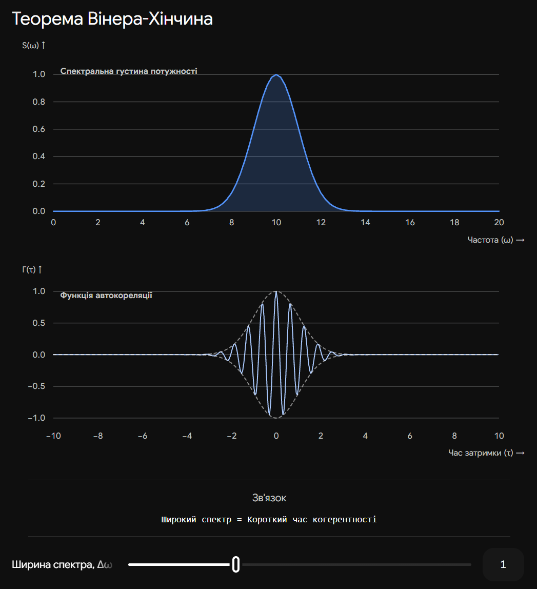
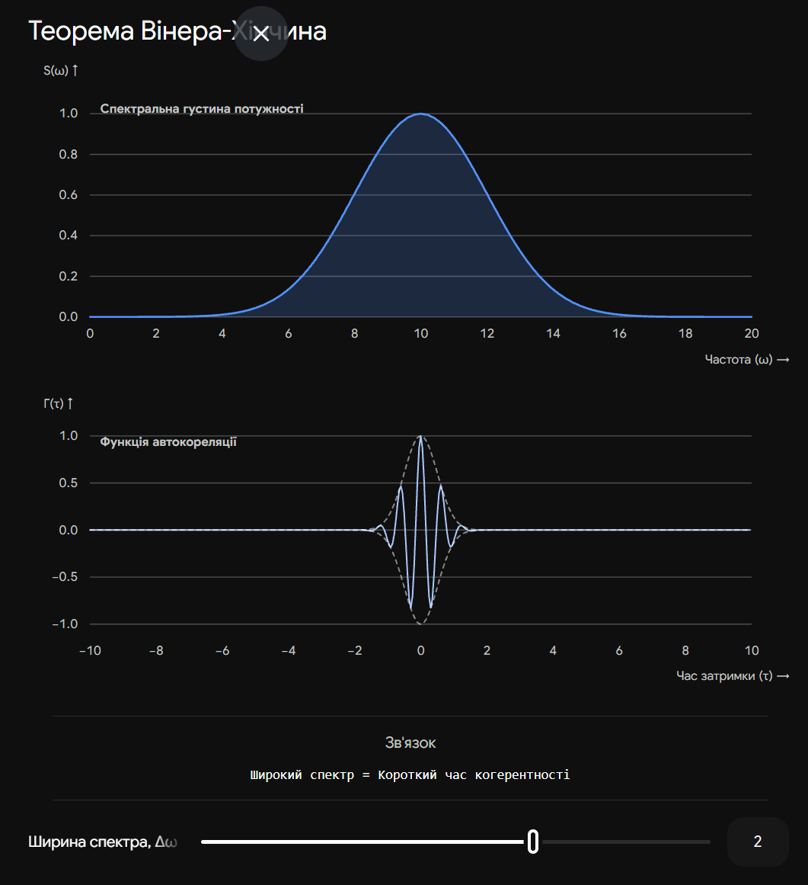

# 28. Кореляційна функція. Зв‘язок функції кореляції зі спектром сигналу

**Ключова ідея білета:** У реальній оптиці світлові хвилі не є ідеально правильними синусоїдами — їхня фаза та амплітуда постійно зазнають випадкових флуктуацій. Щоб описати такі хвилі, використовують **кореляційну функцію**, яка показує, наскільки сигнал "пам'ятає" своє минуле (часову когерентність). Фундаментальний закон фізики (теорема Вінера-Хінчина) стверджує, що ця здатність "пам'ятати" жорстко пов'язана зі **спектром сигналу** через перетворення Фур'є.

## 1. Кореляційна функція (Функція автокореляції)

Щоб дізнатися, чи узгоджуються коливання хвилі у момент часу $t$ із коливаннями тієї ж хвилі, але через певний проміжок часу $\tau$, математики ввели поняття функції автокореляції $\Gamma(\tau)$.

Вона обчислюється як усереднений за часом добуток напруженості поля $E(t)$ на його зсунуту в часі копію $E^*(t+\tau)$:

$$\Gamma(\tau) = \langle E(t) \cdot E^*(t+\tau) \rangle = \lim_{T \to \infty} \frac{1}{2T} \int_{-T}^{T} E(t) E^*(t+\tau) dt$$

**Фізичний зміст та властивості:**

1. **Максимум при $\tau = 0$:** Якщо зсуву в часі немає, ми просто множимо сигнал сам на себе. $\Gamma(0) = \langle |E(t)|^2 \rangle = I$ (це просто інтенсивність світла, максимальна можлива кореляція).
2. **Спадання з часом:** Зі збільшенням затримки $\tau$ випадкові зміни фази призводять до того, що коливання перестають збігатися. $\Gamma(\tau)$ поступово спадає до нуля.
3. **Час когерентності ($\tau_c$):** Це характерний час затримки, при якому кореляційна функція $\Gamma(\tau)$ зменшується у $e$ разів або падає до нуля. У межах часу $\tau_c$ хвиля здатна утворювати контрастну інтерференційну картину.

_(Часто використовують нормовану кореляційну функцію $\gamma(\tau) = \Gamma(\tau) / \Gamma(0)$, значення якої лежить у межах від 0 до 1 і називається **ступенем часової когерентності**)._

---

## 2. Зв'язок зі спектром (Теорема Вінера-Хінчина)

Спектральна густина потужності сигналу (або просто **спектр**, $S(\omega)$) показує, як енергія сигналу розподілена за різними частотами $\omega$.

**Теорема Вінера-Хінчина** встановлює точний математичний зв'язок:

> Функція автокореляції $\Gamma(\tau)$ та спектральна густина потужності $S(\omega)$ стаціонарного випадкового процесу є взаємними перетвореннями Фур'є.

**Пряме перетворення (знаходимо спектр через кореляцію):**

$$S(\omega) = \frac{1}{2\pi} \int_{-\infty}^{\infty} \Gamma(\tau) e^{-i\omega \tau} d\tau$$

**Обернене перетворення (знаходимо кореляцію через спектр):**

$$\Gamma(\tau) = \int_{-\infty}^{\infty} S(\omega) e^{i\omega \tau} d\omega$$

---

## 3. Фізичні наслідки для оптики

Ця теорема має колосальне значення і пояснює поведінку світла від різних джерел:

| Джерело світла                               | Спектр $S(\omega)$                                                    | Кореляційна функція $\Gamma(\tau)$                            | Наслідок                                                                                                                         |
| -------------------------------------------- | --------------------------------------------------------------------- | ------------------------------------------------------------- | -------------------------------------------------------------------------------------------------------------------------------- |
| **Ідеальний лазер** (математична абстракція) | Нескінченно вузька лінія (Дельта-функція на одній частоті $\omega_0$) | Нескінченна гармоніка, не спадає ($\tau_c \to \infty$)        | Хвиля ідеально когерентна. Інтерференція можлива при будь-якій різниці ходу.                                                     |
| **Реальний лазер / спектральна лампа**       | Вузький дзвоноподібний пік (ширина $\Delta \omega$)                   | Коливання з амплітудою, що повільно спадає. $\tau_c$ великий. | Хороша когерентність. Можна спостерігати інтерференцію при великій різниці ходу (метри).                                         |
| **Біле світло** (Сонце, лампа розжарювання)  | Дуже широкий неперервний спектр ($\Delta \omega \to \infty$)          | Амплітуда спадає майже миттєво ($\tau_c \approx 10^{-14}$ с)  | Когерентність майже відсутня. Інтерференція можлива лише при різниці ходу порядку кількох мікрометрів (як у мильних бульбашках). |

**Головне правило (Співвідношення невизначеностей):**
Чим ширший спектр сигналу ($\Delta \omega$), тим вужча його кореляційна функція (менший час когерентності $\tau_c$), і навпаки:

$$\Delta \omega \cdot \tau_c \approx 2\pi \quad \text{або} \quad \Delta \nu \cdot \tau_c \approx 1$$

## Висновок

Кореляційна функція є мірою "передбачуваності" світлової хвилі у часі. Теорема Вінера-Хінчина доводить, що ця передбачуваність цілком визначається шириною спектра джерела. Щоб отримати світло з великим часом когерентності (яке довго зберігає здатність до інтерференції), необхідно максимально звузити його спектр, пропустивши через монохроматор або інтерференційний фільтр.

---

Ось інтерактивна візуалізація теореми Вінера-Хінчина. Вона показує, як зміна ширини спектра миттєво впливає на кореляційну функцію (час когерентності).

