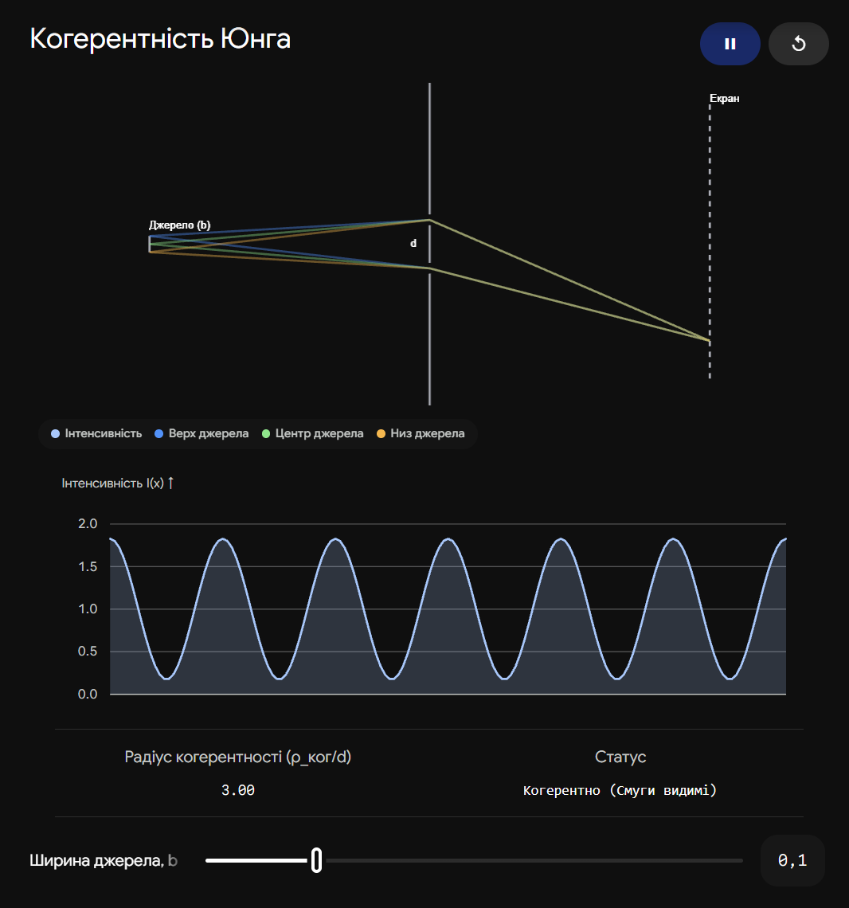
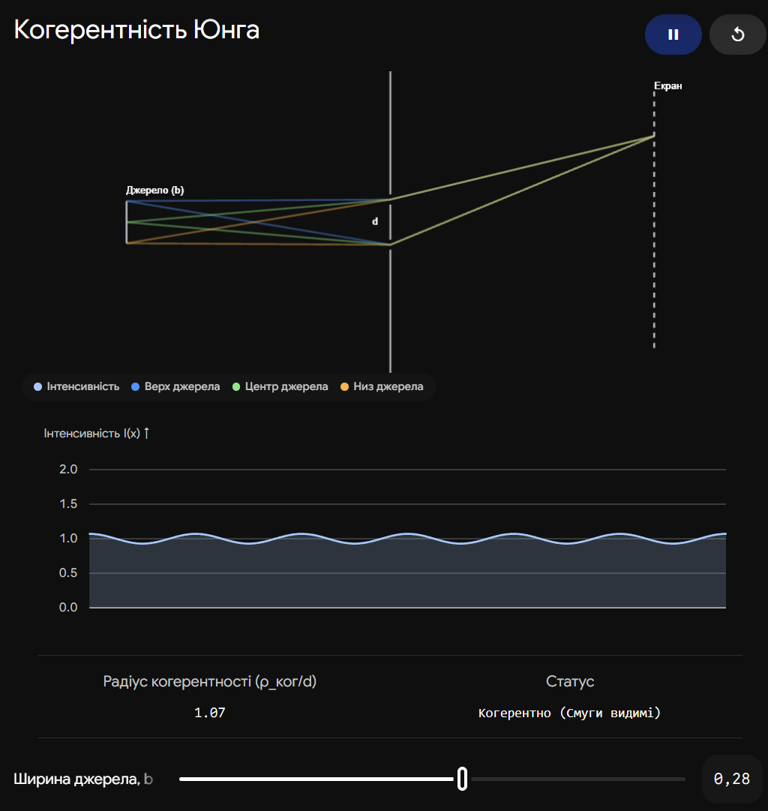

# 29. Інтерференція світла від протяжного монохроматичного джерела світла. Просторова когерентність

**Ключова ідея білета:** У попередньому білеті ми з'ясували, що інтерференція обмежується неідеальною монохроматичністю (спектром) — це _часова_ когерентність. Але є і друге обмеження: реальні джерела світла не є нескінченно малими точками, вони мають фізичні розміри. **Просторова когерентність** описує здатність хвиль, випромінених різними точками просторового джерела, утворювати спільну інтерференційну картину. Якщо джерело занадто широке, інтерференція зникає.

---

## 1. Механізм зникнення інтерференції (Чому розмір має значення?)

Уявімо класичний дослід Юнга (дві щілини), який освітлюється не точковим джерелом, а лампою певної ширини $b$.

1. Протяжне джерело можна уявити як набір великої кількості незалежних точкових джерел.
2. Кожна точка цього джерела випромінює свої власні хвилі, які проходять через дві щілини і створюють на екрані свою власну інтерференційну картину (систему світлих і темних смуг).
3. Оскільки різні точки джерела знаходяться під різними кутами до щілин, їхні **інтерференційні картини на екрані виявляються зміщеними** одна відносно одної.
4. **Критичний момент:** Якщо джерело світла розширювати, настане момент, коли світла смуга від лівого краю джерела накладеться точно на темну смугу від правого краю джерела. Максимуми і мінімуми від різних точок повністю перемішаються.
5. **Результат:** На екрані замість смуг ми побачимо рівномірне суцільне освітлення. Інтерференція "розмивається".

---

## 2. Радіус просторової когерентності ($\rho_{ког}$)

Щоб зрозуміти, за яких умов інтерференція ще можлива, вводять поняття радіуса просторової когерентності.

Уявімо фронт хвилі, що приходить від протяжного джерела. Фаза коливань на цьому фронті не є ідеально рівною, вона випадково "тремтить" через те, що хвиля є сумою випромінювань від багатьох незалежних атомів джерела.

- **Радіус просторової когерентності ($\rho_{ког}$)** — це максимальна відстань між двома точками на хвильовому фронті (наприклад, відстань між двома щілинами Юнга $d$), при якій ці точки ще можуть діяти як когерентні джерела і давати інтерференційну картину.

**Головна формула просторової когерентності:**

$$\rho_{ког} \approx \frac{\lambda}{\varphi}$$

| Величина                   | Позначення   | Фізичний зміст                                                                                                                          |
| -------------------------- | ------------ | --------------------------------------------------------------------------------------------------------------------------------------- |
| **Радіус когерентності**   | $\rho_{ког}$ | Максимальна припустима відстань між точками (щілинами) для спостереження смуг.                                                          |
| **Довжина хвилі**          | $\lambda$    | Довжина хвилі світла (колір).                                                                                                           |
| **Кутовий розмір джерела** | $\varphi$    | Кут, під яким видно джерело світла з місця розташування щілин. $\varphi \approx b/L$, де $b$ — ширина джерела, $L$ — відстань до нього. |

**Умова спостереження інтерференції:** Відстань між отворами/щілинами ($d$) має бути меншою за радіус когерентності хвилі, що на них падає:

$$d < \rho_{ког} \implies d < \frac{\lambda}{\varphi}$$

---

## 3. Практичне значення та приклади

**1. Зоряний інтерферометр Майкельсона:**
Зорі є величезними кулями, але вони знаходяться настільки далеко, що їхній кутовий розмір $\varphi$ мізерно малий. Тому світло від зір має гігантський радіус просторової когерентності ($\rho_{ког}$ сягає десятків метрів). Майкельсон використав це: він розсував дзеркала телескопа доти, поки інтерференційні смуги від зорі не зникали (коли $d = \lambda/\varphi$). Вимірявши цю відстань $d$, він вперше в історії вирахував кутовий розмір зір (зокрема Бетельгейзе).

**2. Чому важко зробити голограму зі звичайною лампою?**
Звичайна лампа має великий кутовий розмір $\varphi$. Тому її радіус просторової когерентності становить соті частки міліметра. Якщо рознести промені далі, вони перестануть "впізнавати" одне одного.

**3. Унікальність лазера:**
Лазер генерує хвилю, кутова розбіжність якої наближається до нуля ($\varphi \to 0$, дифракційна межа). Відповідно, радіус просторової когерентності лазерного променя дорівнює ширині самого променя. Лазерне світло просторово когерентне по всьому своєму перерізу!

## Висновок

Будь-яка реальна хвиля має подвійне обмеження когерентності. **Часова когерентність** (довжина цуга) визначається тим, наскільки світло монохроматичне (ширина спектра), і обмежує допустиму _подовжню_ різницю ходу променів. **Просторова когерентність** визначається фізичним розміром джерела (його кутовою шириною) і обмежує допустиму _поперечну_ відстань між променями, які ми намагаємося змусити інтерферувати. Що меншим (більш точковим) здається джерело, то вища просторова когерентність його випромінювання.

---

Ця інтерактивна візуалізація демонструє, як розмір джерела впливає на якість (видимість) інтерференційної картини. Розширюючи джерело, ви збільшуєте його кутовий розмір $\varphi$, що зменшує радіус просторової когерентності, аж поки смуги не зникнуть (розмажуться).

