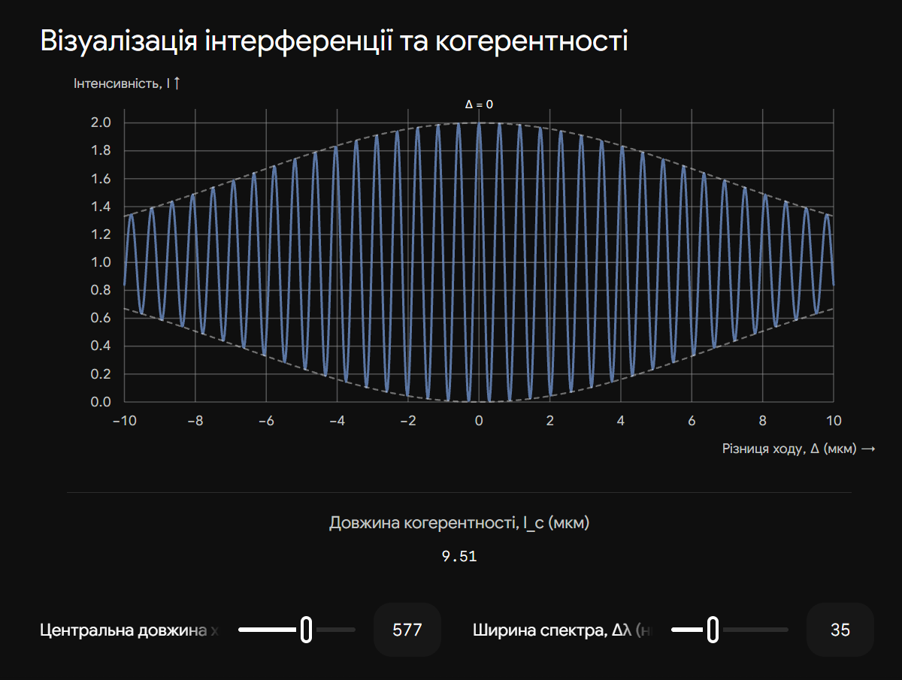
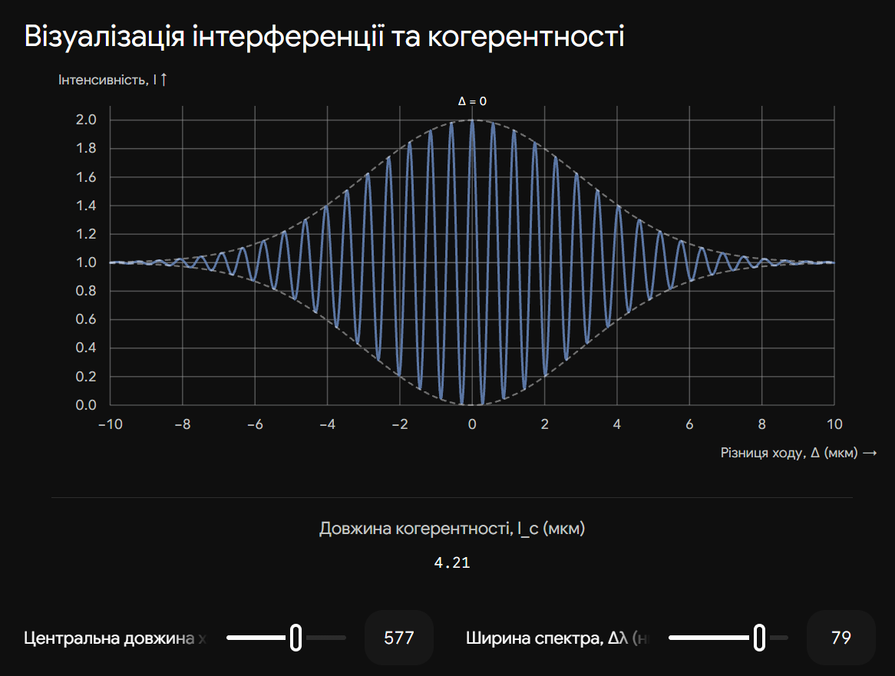

# 30. Часова когерентність. Довжина та час когерентності. Вплив немонохроматичності джерела на видність інтерференційної картини

**Ключова ідея білета:** Жодне реальне джерело не випромінює ідеально монохроматичне світло. Випромінювання складається з окремих, обмежених у часі "шматочків" хвилі — цугів. Щоб два промені могли інтерферувати, вони повинні належати одному й тому ж цугу. Якщо один промінь відстане від іншого на відстань, більшу за довжину цуга, хвилі просто не зустрінуться у просторі, і інтерференція зникне. Це обмеження описується поняттям **часової когерентності**.

## 1. Часова когерентність, час і довжина когерентності

Як ми розглядали у білеті 27, атом випромінює світло у вигляді згасаючого імпульсу (цуга), який триває певний дуже короткий час.

- **Часова когерентність** — це здатність хвилі зберігати сталу фазу по мірі свого поширення вздовж променя (тобто здатність "пам'ятати" свою фазу через певний проміжок часу).

Для кількісного опису цього явища вводять дві фундаментальні величини:

| Величина                  | Позначення | Формула                               | Фізичний зміст                                                                                                                                    |
| ------------------------- | ---------- | ------------------------------------- | ------------------------------------------------------------------------------------------------------------------------------------------------- |
| **Час когерентності**     | $\tau_c$   | $\tau_c \approx \frac{1}{\Delta \nu}$ | Середній час тривалості одного хвильового цуга, протягом якого фаза хвилі залишається передбачуваною. Залежить від ширини спектра ($\Delta \nu$). |
| **Довжина когерентності** | $l_c$      | $l_c = c \cdot \tau_c$                | Просторова довжина хвильового цуга (відстань, яку світло проходить за час $\tau_c$). Для звичайних ламп це міліметри, для лазерів — кілометри.    |

> **Головна умова інтерференції:** Інтерференція спостерігається ТІЛЬКИ тоді, коли оптична різниця ходу між променями ($\Delta$) менша за довжину когерентності джерела:
>
> $$\Delta < l_c$$
>
> Якщо $\Delta \ge l_c$, хвильові цуги від одного атома розходяться настільки, що вже не перекриваються в точці спостереження. Накладаються цуги від _різних_ атомів, їхні фази хаотичні, і замість інтерференції ми бачимо рівномірне освітлення.

---

## 2. Вплив немонохроматичності на видність картини

Реальне світло має певну ширину спектра $\Delta \lambda$. Щоб оцінити якість інтерференційної картини, використовують поняття **видності (контрасту)**:

$$V = \frac{I_{max} - I_{min}}{I_{max} + I_{min}}$$

- $V = 1$: Ідеальна картина (темні смуги абсолютно чорні, $I_{min} = 0$).
- $V = 0$: Інтерференція відсутня (суцільний сірий фон, $I_{max} = I_{min}$).

**Механізм зникнення смуг:**

1. Немонохроматичне світло можна уявити як суміш хвиль з різними довжинами ($\lambda_1, \lambda_2 \dots$).
2. Кожна довжина хвилі будує на екрані _свою власну_ систему інтерференційних смуг.
3. Оскільки відстань між смугами залежить від $\lambda$ ($\Delta x = \frac{L}{d}\lambda$), смуги різних кольорів мають різний масштаб.
4. У центрі картини ($\Delta = 0$) максимуми всіх кольорів збігаються — ми бачимо чітку світлу (білу) смугу.
5. Але при віддаленні від центру (зі зростанням $\Delta$) "червоні" максимуми починають відставати від "синіх". При певній різниці ходу **максимум однієї довжини хвилі накладається на мінімум іншої**.
6. Картини "змазуються", смуги зникають, видність $V$ падає до нуля.

---

## 3. Зв'язок довжини когерентності з шириною спектра

Екзаменатор обов'язково попросить вивести або написати формулу, яка пов'язує просторову характеристику ($l_c$) зі спектральною ($\Delta \lambda$).

1. З теорії Фур'є (білет 27) ми знаємо зв'язок частоти і часу: $\Delta \nu \cdot \tau_c \approx 1$.
2. Перейдемо від лінійної частоти $\nu$ до довжини хвилі $\lambda$ (знаючи, що $\nu = c/\lambda$). Візьмемо диференціал (модуль):

$$|\Delta \nu| = \frac{c}{\lambda^2} \Delta \lambda$$

3. Підставимо це у формулу для часу когерентності:

$$\tau_c = \frac{1}{\Delta \nu} = \frac{\lambda^2}{c \cdot \Delta \lambda}$$

4. Оскільки довжина когерентності $l_c = c \cdot \tau_c$, швидкість світла $c$ скорочується, і ми отримуємо **найважливішу формулу білета**:

$$l_c \approx \frac{\lambda^2}{\Delta \lambda}$$

**Фізичний наслідок:** Чим ширший спектр джерела ($\Delta \lambda$ велике), тим менша його довжина когерентності ($l_c$ мале), і тим при меншій різниці ходу зникають інтерференційні смуги.

- Для білого світла ($\lambda \approx 500$ нм, $\Delta \lambda \approx 300$ нм): $l_c \approx 1$ мкм (інтерференцію видно лише у мильних плівках).
- Для лазера ($\Delta \lambda \approx 0.0001$ нм): $l_c$ сягає кілометрів!

## Висновок

Часова когерентність обмежує _максимально допустиму поздовжню різницю ходу_ між променями. Це обмеження виникає через немонохроматичність джерела світла: накладання інтерференційних картин від різних довжин хвиль призводить до розмиття смуг. Видність картини залишається високою лише доти, доки різниця ходу не перевищує довжину когерентності ($l_c = \lambda^2 / \Delta \lambda$).

---

Ця інтерактивна візуалізація демонструє вплив ширини спектра на видність (контраст) інтерференційної картини по мірі збільшення різниці ходу $\Delta$. Збільшуючи ширину спектра, ви побачите, як стрімко зменшується довжина когерентності, і смуги швидше "затухають".

