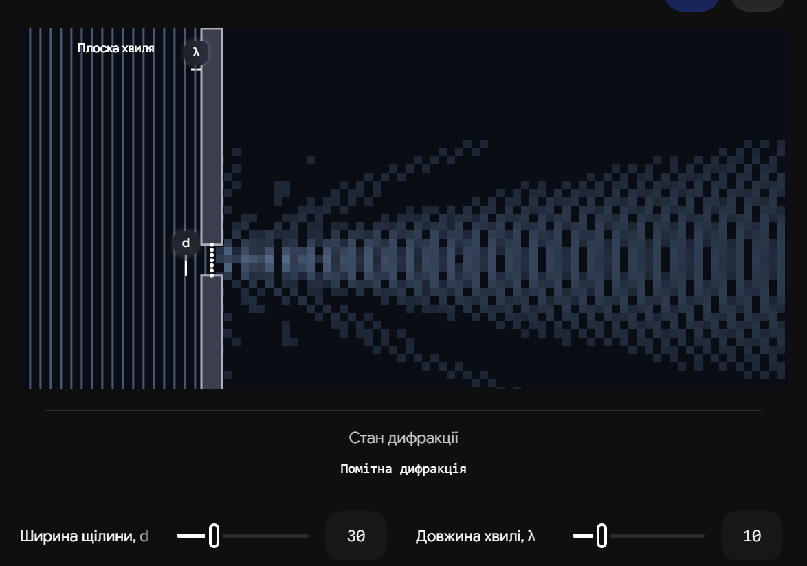
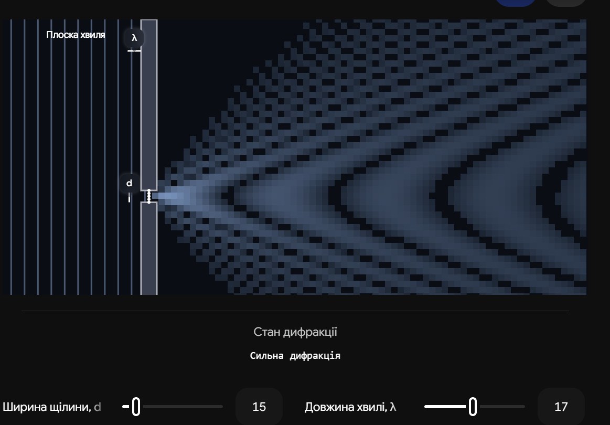

# 31. Дифракція світла. Принцип Гюйгенса-Френеля

**Ключова ідея білета:** З точки зору геометричної оптики світло поширюється строго прямолінійно, утворюючи чіткі тіні за перешкодами. Однак, оскільки світло — це хвиля, воно здатне **огинати перешкоди** і проникати в область геометричної тіні. Це явище називається дифракцією. Щоб пояснити і розрахувати дифракцію, використовують фундаментальний принцип Гюйгенса-Френеля, який зводить складну хвилю до суми безлічі простих вторинних хвиль.

## 1. Явище дифракції

**Дифракція** — це відхилення світла від прямолінійного поширення, яке проявляється в огинанні світловими хвилями перешкод і проникненні світла в область геометричної тіні.

Дифракція є універсальною хвильовою властивістю (вона притаманна і звуку, і хвилям на воді). Але щоб помітити її для світла (де довжина хвилі $\lambda$ надзвичайно мала, $\sim 0.5$ мкм), потрібні особливі умови:

1. Розмір перешкоди або отвору ($d$) має бути сумірним із довжиною хвилі ($d \sim \lambda$).
2. Або екран для спостереження має знаходитися дуже далеко від перешкоди (щоб хвиля встигла "затекти" в тінь).

---

## 2. Принцип Гюйгенса (Геометрична модель)

Християн Гюйгенс першим запропонував хвильовий механізм поширення світла.

> **Принцип Гюйгенса:** Кожна точка середовища, до якої дійшов хвильовий фронт, стає джерелом вторинних сферичних хвиль. Нове положення хвильового фронту в наступний момент часу — це просто поверхня, що огинає всі ці вторинні хвилі (їхня обвідна).

**Проблема моделі Гюйгенса:** Цей принцип був суто геометричним. Він чудово пояснював закони відбивання та заломлення, але **не міг** пояснити, чому енергія розподіляється нерівномірно (утворюються світлі й темні смуги), і чому вторинні хвилі не випромінюють енергію назад (до джерела).

---

## 3. Доповнення Френеля (Хвильова модель)

Огюстен Жан Френель доповнив принцип Гюйгенса ідеєю інтерференції, перетворивши його на потужний математичний інструмент.

> **Принцип Гюйгенса-Френеля:** Світлова хвиля, що збуджується яким-небудь джерелом, може бути подана як результат суперпозиції (інтерференції) когерентних вторинних сферичних хвиль, які випромінюються кожною точкою хвильового фронту.

**Суть ідеї Френеля:**

1. **Когерентність:** Оскільки всі вторинні джерела на фронті породжені однією первинною хвилею, вони є повністю когерентними (мають однакову частоту і сталу різницю фаз).
2. **Інтерференція:** Світлові смуги та тіні за перешкодою виникають тому, що ці вторинні хвилі, накладаючись одна на одну в певній точці простору, можуть як підсилювати одна одну (максимум), так і гасити (мінімум).
3. **Діаграма спрямованості:** Френель ввів залежність амплітуди вторинної хвилі від напрямку випромінювання. Вона максимальна вперед і дорівнює нулю у зворотному напрямку.

---

## 4. Математичний запис (Інтеграл Френеля)

На іспиті часто вимагають написати формулу, яка описує цей принцип.
Нехай ми маємо хвильову поверхню $S$. Щоб знайти напруженість електричного поля (амплітуду світла) $E$ в довільній точці спостереження $P$, потрібно просумувати (проінтегрувати) внески від усіх нескінченно малих елементів площі $dS$ цієї поверхні:

$$E(P) = \iint_{S} K(\varphi) \cdot \frac{a_0}{r} \cdot e^{-i(kr - \omega t)} dS$$

| Елемент формули             | Фізичний зміст                                                                                                                                                                                                                   |
| --------------------------- | -------------------------------------------------------------------------------------------------------------------------------------------------------------------------------------------------------------------------------- |
| **$dS$**                    | Нескінченно малий елемент хвильового фронту (вторинне точкове джерело).                                                                                                                                                          |
| **$\frac{a_0}{r}$**         | Амплітуда сферичної хвилі. Зменшується обернено пропорційно відстані $r$ від елемента $dS$ до точки $P$.                                                                                                                         |
| **$e^{-i(kr - \omega t)}$** | Фазовий множник хвилі (враховує набіг фази за час проходження відстані $r$). Саме він забезпечує математичний опис інтерференції.                                                                                                |
| **$K(\varphi)$**            | **Коефіцієнт нахилу.** Залежить від кута $\varphi$ між нормаллю до $dS$ та напрямком на точку $P$. Якщо $\varphi = 0$ (вперед), він максимальний. Якщо $\varphi = \pi$ (назад), $K = 0$. Це вирішило проблему "зворотної хвилі". |

## Висновок

Принцип Гюйгенса-Френеля є фундаментальним постулатом хвильової оптики. Він стверджує, що для розрахунку освітленості за будь-якою перешкодою (щілиною, отвором, краєм екрана) достатньо розбити відкриту частину хвильового фронту на безліч точкових джерел, а потім скласти всі їхні хвилі в точці спостереження з урахуванням фаз. Саме цей підхід дозволив повністю і математично точно описати дифракційні картини.

---

Ця інтерактивна візуалізація допоможе вам побачити, як працює принцип Гюйгенса-Френеля на практиці. Плоска хвиля (зліва) розбивається на щілині на серію вторинних "точкових" джерел. Зверніть увагу, як їхні сферичні хвилі перетинаються і шляхом інтерференції формують центральний промінь та дифракційні "вуса" з боків.

