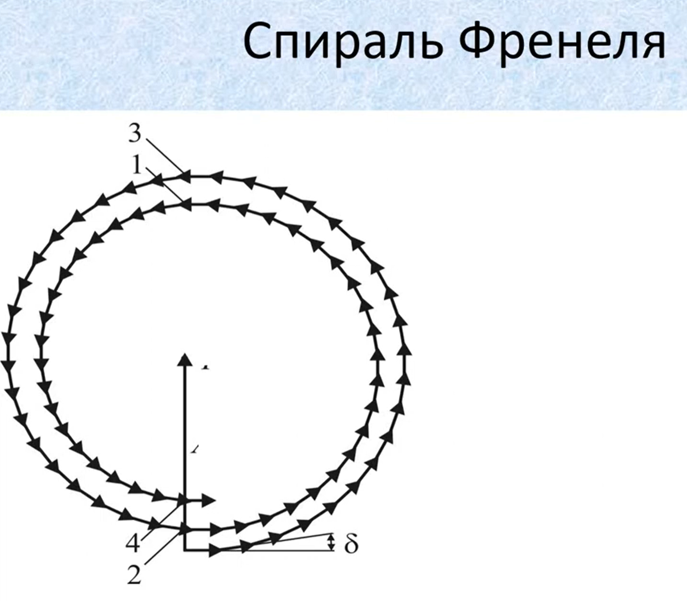
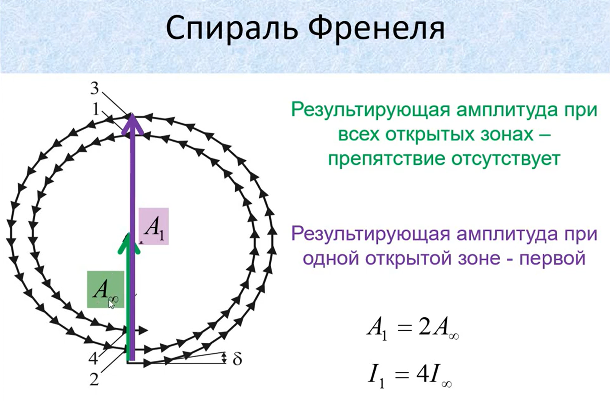

# 32. Метод зон Френеля. Спіраль Френеля. Дифракція на круглому отворі та круглому екрані

**Ключова ідея білета:** Розв'язувати складний інтеграл Гюйгенса-Френеля для сферичної хвилі дуже важко. Френель винайшов геніальний геометричний метод: він розбив хвильовий фронт на кільцеві зони так, щоб хвилі від сусідніх зон приходили в точку спостереження у протифазі і частково гасили одна одну. Цей метод блискуче пояснює появу світлих і темних плям при дифракції на круглих перешкодах.

## 1. Метод зон Френеля

Нехай маємо точкове джерело світла $S$, яке випромінює монохроматичну сферичну хвилю, і точку спостереження $P$.
Френель запропонував розбити сферичний хвильовий фронт на концентричні кільцеві зони за таким правилом:
**Відстань від країв кожної наступної зони до точки $P$ має бути на півхвилі ($\lambda/2$) більшою, ніж від попередньої.**

Математичні та фізичні наслідки такого розбиття:

1. **Радіус $m$-ї зони ($r_m$):**

$$r_m \approx \sqrt{m \lambda \frac{ab}{a+b}}$$

_(де $a$ — відстань від джерела до хвильової поверхні, $b$ — відстань від хвильової поверхні до точки $P$, $m = 1, 2, 3...$ — номер зони). Оскільки $\lambda$ дуже мала, радіуси зон становлять долі міліметра._ 2. **Протифазність:** Через різницю ходу рівно в $\lambda/2$, хвиля від кожної парної зони приходить у точку $P$ у протифазі до хвилі від непарної зони. 3. **Рівність площ:** Площі всіх зон Френеля приблизно однакові. 4. **Зменшення амплітуди:** Зі збільшенням номера зони $m$ кут нахилу до точки $P$ зростає. Через це амплітуда вторинних хвиль повільно, але монотонно зменшується: $A_1 > A_2 > A_3 > \dots$

**Загальна амплітуда від повністю відкритого фронту:**

$$A = A_1 - A_2 + A_3 - A_4 + \dots$$

Оскільки спадання амплітуд плавне, можна вважати, що $A_m \approx \frac{A_{m-1} + A_{m+1}}{2}$.
Після математичних скорочень цього ряду виявляється дивовижний факт:

$$A \approx \frac{A_1}{2}$$

_(Амплітуда світла від нескінченно відкритого хвильового фронту дорівнює половині амплітуди від однієї лише першої, центральної зони Френеля)._

---

## 2. Спіраль Френеля (Векторна діаграма)

Для наочності додавання хвиль використовують метод векторних діаграм.
Кожну зону Френеля розбивають на ще дрібніші кільцеві підзони. Кожна підзона дає свій вектор амплітуди, повернутий на невеликий кут (через зміну фази).

- Вектори однієї (першої) зони Френеля утворюють півколо (фаза змінюється від $0$ до $\pi$).
- Вектори другої зони продовжують криву, утворюючи друге півколо (від $\pi$ до $2\pi$).
- Оскільки амплітуда від кожної наступної зони трохи менша (вектори стають коротшими), ці півкола не замикаються в ідеальні кола, а закручуються у **спіраль**.

Спіраль скручується до фокусної точки. Вектор, проведений з початку координат у центр цієї спіралі, якраз і дорівнює $\frac{A_1}{2}$.

---

## 3. Дифракція на круглому отворі

Уявімо, що на шляху хвилі поставили непрозорий екран із круглим отвором радіусом $r$. Відкрита лише певна кількість зон Френеля ($m$). Що ми побачимо в центрі екрана?

Результат залежить виключно від того, парна чи непарна кількість зон вмістилася в отворі:

1. **$m$ — непарне число (1, 3, 5...):**

$$A = A_1 - A_2 + A_3 \approx A_1$$

У центрі картини буде **максимум (світла пляма)**. (При $m=1$ інтенсивність у центрі в 4 рази більша, ніж була б узагалі без перешкоди, оскільки $I \sim A^2 \approx A_1^2$, а без отвору $I \sim (A_1/2)^2$). 2. **$m$ — парне число (2, 4, 6...):**

$$A = A_1 - A_2 \approx 0$$

Хвилі від двох сусідніх зон майже повністю гасять одна одну. У центрі картини буде **мінімум (темна пляма)**.

> _Зауваження:_ На практиці кількість відкритих зон змінюють не лише розширюючи отвір, а й просто наближаючи чи віддаляючи екран (змінюючи параметр $b$ у формулі радіуса). Тоді центральна пляма періодично блимає, стаючи то чорною, то світлою.

---

## 4. Дифракція на круглому екрані (Пляма Пуассона-Араго)

Це найвідоміший історичний парадокс хвильової оптики.
Нехай на шляху світла стоїть маленький непрозорий круглий диск (наприклад, металева кулька), який закриває рівно $m$ перших зон Френеля.

Якою буде освітленість у центрі геометричної тіні за диском?
Відкритими залишаються зони, починаючи з $(m+1)$:

$$A = A_{m+1} - A_{m+2} + A_{m+3} - \dots$$

За тією ж логікою скорочення рядів:

$$A \approx \frac{A_{m+1}}{2}$$

Амплітуда $A_{m+1}$ для не дуже великих екранів майже дорівнює амплітуді $A_1$.
**Висновок:** У самому центрі абсолютно чорної геометричної тіні від круглого екрана **завжди є світла пляма**, інтенсивність якої майже дорівнює інтенсивності світла без екрана взагалі.

_(Історична довідка: Французький фізик Пуассон, будучи прихильником корпускулярної теорії Ньютона, вивів цей парадоксальний наслідок із теорії Френеля, щоб довести її абсурдність. Але Домінік Араго провів експеримент і дійсно побачив цю світлу пляму, що стало тріумфом хвильової оптики)._

---

https://www.youtube.com/watch?v=gE3zO9FSDm0

https://youtu.be/98_REjsIG-o?si=MaJszZC7A2OY2TCE
