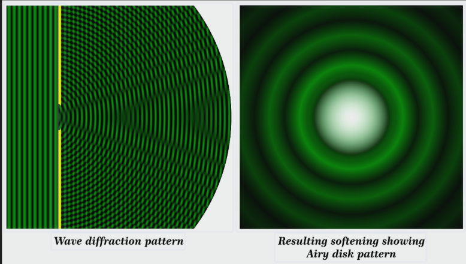

# 35. Дифракція Фраунгофера від одної щілини, від прямокутного та круглого отвору

**Ключова ідея білета:** На відміну від дифракції Френеля (у сферичних хвилях на скінченній відстані), дифракція Фраунгофера розглядається **в паралельних променях** (плоска хвиля). Вона спостерігається нескінченно далеко від перешкоди або, на практиці, **у фокальній площині збиральної лінзи**. Її математичний апарат набагато простіший: розподіл амплітуд на екрані є просто перетворенням Фур'є від форми отвору.

---

## 1. Дифракція від однієї щілини

Нехай на вузьку нескінченно довгу щілину шириною $b$ падає плоска монохроматична хвиля (перпендикулярно до площини щілини). За щілиною стоїть лінза, яка збирає паралельні пучки променів, що відхилилися на кут $\varphi$, у фокальній площині на екрані.

Щоб знайти освітленість у точці екрана під кутом $\varphi$, розіб'ємо ширину щілини на зони Френеля (смужки, різниця ходу від країв яких дорівнює $\lambda/2$).
Оптична різниця ходу між крайніми променями від щілини дорівнює:

$$\Delta = b \sin \varphi$$

**1. Умова мінімумів (темні смуги):**
Якщо в різниці ходу вкладається парна кількість півхвиль (або ціле число хвиль), зони попарно гасять одна одну.

$$b \sin \varphi = \pm m \lambda$$

_(де $m = 1, 2, 3 \dots$ — порядок мінімуму. Увага: $m \neq 0$, оскільки $\varphi=0$ відповідає максимуму)._

**2. Умова максимумів (світлі смуги):**
Якщо вкладається непарна кількість півхвиль, одна зона залишається нескомпенсованою і дає світло.

$$b \sin \varphi = \pm \left(m + \frac{1}{2}\right) \lambda$$

**Розподіл інтенсивності:**
Математично інтенсивність $I$ описується функцією:

$$I(\varphi) = I_0 \left( \frac{\sin u}{u} \right)^2, \quad \text{де} \quad u = \frac{\pi b \sin \varphi}{\lambda}$$

- **Центральний максимум ($\varphi = 0$):** У ньому зосереджено понад $90\%$ усієї світлової енергії. Його ширина вдвічі більша за ширину бічних максимумів.
- **Вплив ширини щілини:** Чим вужча щілина ($b \to 0$), тим ширшим стає центральний максимум (світло сильніше "розбігається" в боки).

---

## 2. Дифракція від прямокутного отвору

Якщо світло падає на прямокутний отвір із розмірами $a$ (по осі $X$) та $b$ (по осі $Y$), дифракція відбувається в обох взаємно перпендикулярних напрямках незалежно.

**Картина на екрані:**

- Вона має вигляд **дифракційного хреста**, що складається зі світлих прямокутних плям.
- Найяскравіша і найбільша пляма знаходиться в центрі.
- Інтенсивність визначається добутком двох функцій від однієї щілини:

$$I = I_0 \left( \frac{\sin u}{u} \right)^2 \left( \frac{\sin v}{v} \right)^2$$

_(де $u$ залежить від розміру $a$, а $v$ — від розміру $b$)._

- **Правило зворотних пропорцій:** У тому напрямку, де щілина вужча (наприклад, щілина дуже вузька по вертикалі $y$), дифракційні плями розтягнуті найсильніше (дифракційний хрест буде широким по вертикалі).

---

## 3. Дифракція від круглого отвору

Це найважливіший випадок для практичної оптики, оскільки будь-який об'єктив (телескопа, мікроскопа, ока) є круглим отвором (діаметром $D$), який обмежує хвильовий фронт.

**Картина на екрані (Пляма Ейрі):**
Через кругову симетрію отвору дифракційна картина має вигляд **центрального яскравого круга (диска Ейрі)**, оточеного серією темних і світлих концентричних кілець.

У диску Ейрі зосереджено близько $84\%$ всієї енергії світла. Радіус цього диска (тобто кут $\varphi$, під яким спостерігається перше темне кільце) визначається нулем спеціальної функції Бесселя. Для круглого отвору формула першого мінімуму набуває вигляду:

$$\sin \varphi = 1.22 \frac{\lambda}{D}$$

Оскільки кут дифракції зазвичай дуже малий, $\sin \varphi \approx \varphi$:

$$\varphi \approx 1.22 \frac{\lambda}{D}$$

**Фізичний наслідок:**
Світна точка через дифракцію на круглому об'єктиві завжди зображується не як ідеальна точка, а як розмита пляма (диск Ейрі). Це встановлює **дифракційну межу роздільної здатності** будь-яких оптичних приладів: ми не зможемо побачити дрібні деталі, розмір яких менший за розмір цього диска. Щоб зробити пляму меншою і побачити чіткіше, потрібно або збільшувати діаметр об'єктива ($D$), або використовувати коротші хвилі ($\lambda$).
