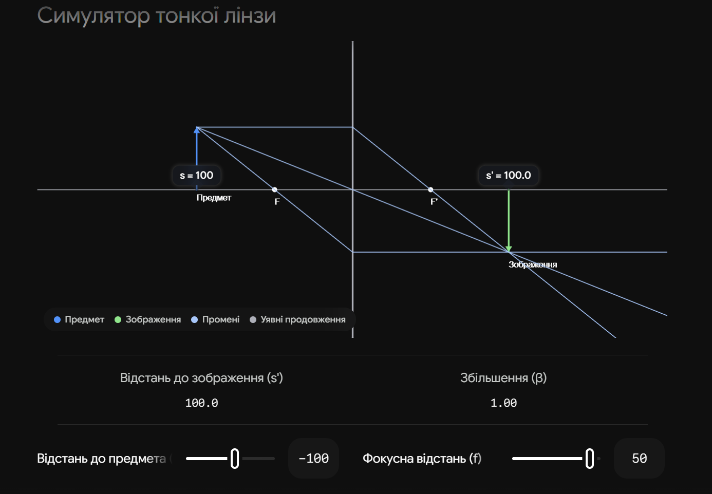

# 6. Формула тонкої лінзи. Типи лінз

**Тонка лінза** — це прозоре тіло, обмежене двома сферичними поверхнями, товщина якого ($d$) є нехтовно малою порівняно з радіусами кривизни цих поверхонь ($d \ll R_1, R_2$). Це наближення дозволяє вважати, що світло заломлюється не на двох різних межах, а в одній "головній площині" лінзи.

## 1. Типи лінз

Залежно від того, як лінза змінює пучок паралельних променів (якщо вона знаходиться в оптично менш густому середовищі, наприклад, у повітрі), лінзи поділяють на два класи:

| Тип лінзи        | Оптична сила ($\Phi$) | Задній фокус ($f'$) | Геометрична форма               | Типи поверхонь                                 |
| ---------------- | --------------------- | ------------------- | ------------------------------- | ---------------------------------------------- |
| **Збиральні**    | $\Phi > 0$            | Дійсний ($> 0$)     | Товщі посередині, ніж на краях. | Двоопукла, плоско-опукла, увігнуто-опукла.     |
| **Розсіювальні** | $\Phi < 0$            | Уявний ($< 0$)      | Тонші посередині, ніж на краях. | Двоввігнута, плоско-увігнута, опукло-увігнута. |

## 2. Основні формули

В університетському курсі оптики найчастіше використовують **декартове правило знаків**: початок координат у центрі лінзи, світло йде зліва направо ($s < 0$ для дійсного предмета).

**1. Формула тонкої лінзи (Зв'язок спряжених точок):**

$$\frac{1}{s'} - \frac{1}{s} = \frac{1}{f'}$$

_(де $s$ — координата предмета, $s'$ — координата зображення, $f'$ — координата заднього фокуса)._

> _Примітка:_ У шкільній практиці частіше застосовують модульну формулу: $\pm\frac{1}{d} \pm \frac{1}{f} = \pm\frac{1}{F}$, де знаки ставлять вручну залежно від дійсності/уявності предмета та зображення. Для іспиту з Ландсберга краще використовувати університетську декартову (з $s$ та $s'$).

**2. Формула оптичної сили лінзи (Рівняння шліфувальника лінз):**
Визначає фокусну відстань через радіуси поверхонь та матеріал:

$$\Phi = \frac{1}{f'} = \left( \frac{n_л}{n_с} - 1 \right) \left( \frac{1}{R_1} - \frac{1}{R_2} \right)$$

*(де $n*л$ — показник заломлення лінзи, $n_с$ — середовища навколо; $R_1, R_2$ — радіуси кривизни поверхонь з урахуванням знаку).\_

**3. Поперечне (лінійне) збільшення лінзи ($\beta$):**

$$\beta = \frac{s'}{s}$$

_(Якщо $\beta > 0$ — зображення пряме та уявне; якщо $\beta < 0$ — зображення перевернуте та дійсне)._

## 3. Декартове правило знаків (Критично для рівняння шліфувальника)

Щоб друга формула працювала правильно, треба пам'ятати знаки радіусів:

- Центр кривизни праворуч від поверхні (випукла назустріч світлу) $\rightarrow R > 0$.
- Центр кривизни ліворуч (увігнута) $\rightarrow R < 0$.
- Плоска поверхня $\rightarrow R = \infty$ (тоді $\frac{1}{R} = 0$).

**Висновок:** Формула тонкої лінзи є прямим наслідком послідовного застосування формули заломлення сферичної поверхні (з білета №5) до двох поверхонь лінзи за умови $d \to 0$. Збиральні лінзи формують як дійсні, так і уявні зображення (залежно від положення предмета), тоді як розсіювальні — завжди дають зменшене, пряме і уявне зображення дійсного предмета.

---

Ось інтерактивний симулятор для візуалізації побудови зображень у тонкій лінзі, що чудово допомагає запам'ятати хід трьох основних променів:

